# Execution graph

The tech lead's dependency graph of every unit of work: done, in flight, queued, or waiting on Issao.
Owned by the tech lead; updated on every spawn, merge and ETA change, in the same commit where possible.
Per Issao: *"keep an instruction graph of everything that we need to in an md file, with sections below
of what each task entails."* A stale graph is worse than none, so the status line moves every time.

**Last updated:** 2026-09-06 16:39 PDT. **Done 17 · in flight 6 · queued 20 · waiting on Issao 2.**
**Critical path to the next Issao-visible milestone (real runs in the dashboard, first deploy):**
U13 export (done) → U17 replay source → integrate + deploy. ETA ~18:00 PDT (fleet panels); the heatmap
follows when U22 lands (per-replica rows, unblocked now that U15's frames are on master).

Legend: solid box = done; **bold** = in flight, with branch; plain = queued; dashed = waiting on Issao.
Edge labels name the stand-in that let the downstream unit start early, or why the edge could not be broken.

```mermaid
flowchart TD
  classDef done fill:#d9f2d9,stroke:#2e7d32,color:#000
  classDef flight fill:#fff3cd,stroke:#b26a00,color:#000,font-weight:bold
  classDef queued fill:#f4f4f2,stroke:#888,color:#000
  classDef blocked fill:#fde2e2,stroke:#c62828,color:#000,stroke-dasharray:4 3

  U01[U01 workspace split]:::done
  U02[U02 golden fingerprints]:::done
  U03[U03 wire contract WIRE.md]:::done
  U04[U04 policy trait + registry]:::done
  U05[U05 leases + idle guard]:::done
  U07[U07 bounded builds]:::done
  U09[U09 web transport client]:::done
  U10[U10 least_kv_probe]:::done
  U11[U11 deadline_aware]:::done
  U12[U12 fair_share]:::done
  U13[U13 wire export]:::done
  U14[U14 physics oracle M2a]:::done
  U15[U15 engine core: sim-model, frames, Sim, Leaf seam]:::done
  U16[U16 simplify 1+2]:::done

  U17[U17 replay source + Frame adapter<br/>claude/tl-replay]:::flight
  U18[U18 live ingress server<br/>claude/tl-ingress-server]:::flight
  U19[U19 trace wire + export<br/>claude/tl-trace-wire]:::flight
  U20[U20 arena objective + catalog append<br/>claude/tl-arena-rules]:::flight
  U21[U21 disable_decode<br/>tech lead]:::flight
  U22[U22 preemption + KV eviction<br/>claude/tl-preemption]:::flight

  U23[U23 per-replica export rows + heatmap]:::queued
  U24[U24 trace engine: spans in the step]:::queued
  U25[U25 SLO classes]:::queued
  U26[U26 speculative decoding knob]:::queued
  U27[U27 prefix caching + sessions 9/10]:::queued
  U28[U28 web on live transport]:::queued
  U29[U29 M3 leaf split + shard determinism]:::queued
  U30[U30 tiering 14 + disaggregation 15]:::queued
  U31[U31 failure injection + gray failure 11]:::queued
  U32[U32 autoscaling + multi-geo 12/13]:::queued
  U33[U33 M7 control analysis: Bode]:::queued
  U34[U34 arena generator loop]:::queued
  U35[U35 M4 trace replay workload]:::queued
  U36[U36 leaf as a process]:::queued
  U37[U37 M9 scale validation]:::queued
  U38[U38 traffic shaping contrast report 5]:::queued
  U39[U39 model weights, MoE 17]:::queued
  U40[U40 forecasting policy families]:::queued
  U41[U41 simplify 3..n, one per four merges]:::queued
  U42[U42 SLO class targets]:::blocked
  U43[U43 rule-set version bump sign-off]:::blocked

  U01 --> U04 --> U10 & U11 & U12
  U01 --> U14 --> U22
  U01 --> U15 --> U22 & U18 & U23 & U24 & U29
  U03 --> U09 --> U17
  U03 --> U13 --> U17
  U03 -. "stand-in: WIRE.md prose, own types" .-> U17
  U05 --> U18
  U15 -. "stand-in: run to completion + fleet_rows until Sim" .-> U18
  U13 --> U18
  U13 --> U19
  U24 -. "stand-in: RequestTrace struct with fixtures" .-> U19
  U22 --> U24 & U25 & U26 & U27
  U15 -. "could not break: Replica::step is one function" .-> U22
  U18 --> U28
  U17 --> U28
  U22 --> U30 --> U39
  U31 --> U32
  U32 --> U33
  U15 --> U33
  U04 --> U34
  U20 --> U34
  U16 --> U20
  U29 --> U36 --> U37
  U11 & U12 --> U38
  U25 --> U42
  U20 --> U43
  U40 --> U34
```

## How to read a unit section

Each section names what the unit entails, the files it owns, its upstream and downstream units, the
stand-in interface that let it start before its upstream finished (if any), the agent and branch when in
flight, the stated ETA, and the definition of done: the test, fingerprint check, finding or deploy that
closes it. Every unit ends the way the first six dynamics did: `tools/build.sh test` green,
`./check-fingerprints.sh` PASS (or the baseline updated in the same commit with every moved number
explained), a scenario under `scenarios/` where a dynamic is involved, and a finding handed to
housekeeping for `docs/findings.md`.

## Done

### U01 workspace split
One crate became eleven under `crates/`, per ARCHITECTURE 10.8, with `tests/layering.rs` enforcing the
downward dependency direction and that `sim-ingress` cannot reach `sim-model` or `sim-physics`.
Byte-identical: 40 telemetry summaries and 16 reports. Commit 163995c.

### U02 golden fingerprints
`./check-fingerprints.sh` and `bench/golden-fingerprints.txt`: every demo, holdout and a probe run,
fingerprint, event count, summary md5 and report md5. The proof every later unit cites. 0efb8bd.

### U03 wire contract
`crates/sim-ingress/WIRE.md`: ingress.proto and subscription.proto as JSON over HTTP/1.1 with
server-sent events, proto3 canonical JSON encoding, SSE ids and Last-Event-ID reconnect. Decided over
gRPC to keep the zero-dependency one-second build. Two agents built against it at once. 0efb8bd, afc9ba1.

### U04 policy trait and registry
`sim-policy`: `RoutingPolicy` and `AdmissionPolicy` traits, one file per policy, one registry table
resolving `routing =` and `admission =` names, probes counted and charged. This is the fan-out point
and how the arena's generated policies register. Scenario gained admission, tenants and weights. 289cb22.

### U05 leases and idle guard
`sim-ingress` `lease.rs` and `idle.rs`: the wall-clock lease registry (clamped to Cloud Run's 900 s)
and the idle-shutdown decision (IDLE_SHUTDOWN_SECONDS, default 300). 18 tests. d688f8f.

### U06 homepage report links
Issao's instruction; the six reports linked from the dashboard homepage. Deployed as lbsim-00004. 16daf22.

### U07 bounded builds
Per-worktree target directories after the shared one handed a worktree another branch's rlibs;
`tools/build.sh` bounds concurrent builds to two machine-wide. 289cb22, 16daf22.

### U08 and U16 simplification passes
One per wave of merges, one crate each, zero behaviour change proven by the fingerprint script including
report hashes: `sim-report` 884→851 (4b29810), `sim-arena` 1358→1322 (fd81421).

### U09 web transport client
`web/src/lib/api.ts` and friends, against WIRE.md: bigint-exact uint64, SSE parser with reconnect,
33-case self-test, mock stays the default. 389f41e.

### U10 least_kv_probe · U11 deadline_aware · U12 fair_share
Three policies, one file each. least_kv_probe: live KV on d probes, CV 0.44 vs p2c 0.63 under 4 s
staleness (120e62d). deadline_aware: shed on expected queue wait, goodput 241→496 tok/s at 1.4x
(210b657). fair_share: windowed per-tenant tokens, the over-share tenant is 100% of what is shed, goodput
9,157→14,496 (072a932). Their scenarios enter the demo scripts with U21.

### U13 wire export
`sim-run export --demos`: the six demo groups as WIRE.md JSON under `runs/<id>/` (status, fleet.jsonl,
result.json as metrics.proto RunResult, index.json), 30 runs, 15.2 MB, 6.7 s; a test parses
subscription.proto so metric names and numbers cannot drift. 2354802.

### U14 physics oracle (M2, load-bearing half)
`sim-physics` `epoch.rs`: the analytic epoch advance with bandwidth and compute lines and speculation,
exact in u128 rationals, differential test against the naive loop on 10,000 random epochs, inversion,
calibration anchors (batch-1 10.248 ms vs 10.25; batch-256 7,758 tok/s vs 8,773, 11.6% low), 77x fewer
iterations measured. 35aa8a4.

### U15 engine core
`sim-model` holds `Replica` and the step; `RunResult.frames` gives per-sample window counts,
windowed sparse histograms and per-replica samples; `Sim::new/advance_to/into_result` makes the run
resumable; `sim-leaf-api` is the `Leaf` trait shaped by leaf.proto with `LocalLeaf` wrapping `Sim`
and a `sim-leaf` binary, per Issao's separate-process decision. Four commits, each fingerprint-PASS. ac8d1be.

## In flight

### U17 replay source and Frame adapter (dashboard path C+D)
Load `runs/index.json` and `runs/<id>/{status.json,fleet.jsonl,result.json}` from the served directory
when no Ingress answers; map SubscriptionUpdate rows to the panels' `Frame`; play/pause/speed/step/scrub
local; rewind and update disabled with a visible reason. Files: `web/src/lib/replay.ts`, `adapter.ts`,
`useRun.ts` replay branch, `mode.ts`. Upstream U09, U13 (both done). Stand-in that broke the wait on
U09 earlier: WIRE.md prose with local types; no longer needed since U09 merged first. Downstream U28.
Agent on `claude/tl-replay`. ETA ~17:45. Done: `npm run build`; the six demo runs play in the
dashboard from static files with the load, throughput, latency, imbalance and KV panels real and every
other panel still marked mock; deployed by the main agent.

### U18 live ingress server
`POST /v1/ingress/*` and the SSE `OpenSubscription` per WIRE.md, on the existing HTTP server, driving
`Sim` on a run thread paced by realtime_factor, leases from U05, idle guard wired to checkpoint-and-stop,
GetTraces returning U19's encoding when present. Files: `crates/sim-ingress/src/{server.rs,run.rs,
routes.rs}`, `lib.rs` serve entry. Upstream U05, U13, U15 (all done). Stand-in that was prepared: run
to completion and serve `export::fleet_rows` until `Sim` landed; not needed, U15 merged first.
Downstream U28. Agent on `claude/tl-ingress-server`. ETA ~19:30. Done: a curl script in the crate's tests
starts a run, subscribes, renews, closes, sees idle shutdown fire; `/health` untouched by run state.

### U19 trace wire and export
metrics.proto RequestTrace/TraceSpan as JSON per WIRE.md rules, `GetTraces` filters, traces in the export
under `runs/<id>/traces.jsonl` within the telemetry budget. Files: `crates/sim-metrics/src/trace.rs`
(the struct, a stand-in with fixtures until U24 fills it), `crates/sim-ingress/src/trace_wire.rs`,
`export.rs` additions. Upstream U13 (done); edge from U24 broken by the struct stand-in. Downstream U18,
U24, the dashboard trace panel. Agent on `claude/tl-trace-wire`. Done: field-name test against
metrics.proto; export writes traces for a fixture run.

### U20 arena objective and catalog append
Issao: *"You can remove this, I agreed with this."* The score becomes the minimum over loads of goodput as
a share of offered work; rule-set version bumped and recorded per score. Plus `sim_arena::catalog::append`
writing one row per authored policy to `docs/policy-catalog.md` (header: Name, Family, Idea, Status,
Source, Score, Rule set, Added) with a test that the row matches the file's header. Files:
`crates/sim-arena/src/**`, `tests/arena_*.rs`. Upstream U16 (done). Downstream U34, U43. Agent on
`claude/tl-arena-rules`. Done: `sim-run arena` ranks by share; the append test passes against the
committed catalog.

### U21 disable_decode (tech lead)
Issao: *"we could get disable decode basically by setting HBM to infinity."* Scenario key
`disable_decode` zeroes the bandwidth term of the step cost (infinite HBM); KV accounting unchanged.
Scenarios `route_round_robin_no_decode.txt`, `route_p2c_no_decode.txt`, demo 7, golden rows. Also lands
the U10–U12 scenarios in the demo scripts and the WIRE.md corrections from U13. Done: fingerprints updated
with every moved number explained; finding to housekeeping if the hotspot ordering changes without decode.

### U22 preemption and KV eviction (scope 7/8, the head of the dynamics fan-out)
`PreemptionPolicy` per scenario.proto: never, recompute, swap-to-DRAM, swap-else-recompute, with the
victim choices; sessions so KV fills at low qps; the death-spiral scenario and its survivor in
`run-demos.sh`. Files: `crates/sim-model/**`, `crates/sim-physics/src/lib.rs` (CostModel only),
`sim-scenario` keys, scenarios, tests. Upstream U14, U15, U21. Edge from U15 could not be broken:
`Replica::step` is one function and both units rewrite it. Downstream U24–U27, U30. Agent on
`claude/tl-preemption`. Done: the contrast pair in the report, finding 7 to housekeeping, golden updated.

## Queued

### U23 per-replica export rows and the heatmap
`export::replica_rows` from `RunResult.frames` (landed in U15); the dashboard heatmap on real data.
Upstream U15, U13, U17. Small; second dashboard deploy.

### U24 trace engine
Spans recorded in the step for a seeded, latency-stratified sample of requests (`trace_sample_rate`):
ingress queue, routing decision with candidates and the stale view, replica queue, each prefill chunk and
decode step with batch size, running/queued, KV resident, step time, bandwidth- or compute-bound. Fills
U19's struct. Upstream U22 (same function). Downstream U19's export, the trace panel.

### U25 SLO classes
Per-class first-token and inter-token targets, class on every request, per-class goodput and attainment
in the scorecard and export. Upstream U22. Waits on U42 for the targets (default: interactive 2 s / 80 ms,
agent 5 s / 150 ms, batch 60 s / none).

### U26 speculative decoding knob
Scenario N/M, wired through `CostModel` using U14's compute line; the erosion at large batch as a
finding. Upstream U22 (shares CostModel).

### U27 prefix caching and sessions (9/10)
Session model per ARCHITECTURE §14 row 9 with fork-off and merge-back rates; prefix segment tree in the
replica; affinity routing; the failover-cascade scenario. Upstream U22.

### U28 web on the live transport
Mock markers removed only on wired panels; UpdateWorkload/UpdatePolicies enabled. Upstream U17, U18.

### U29 M3 leaf split
Routing out of the loop through the `Leaf` trait; shard barrier; the determinism-across-shards test at
1, 4, 16 shards. Upstream U15. Downstream U36.

### U30 tiering and disaggregation (14/15)
Cluster-pooled DRAM/SSD owned by Ingress with the bloom-filter residency hint Issao described; prefill and
decode pools with KV transfer over the modelled fabric. Upstream U22.

### U31 failure injection and gray failure (11)
FailureSpec events, health vector, outlier ejection policy. Downstream U32, U38.

### U32 autoscaling and multi-geo (12/13)
Replica lifecycle with turn-up delay, warm pools, diurnal load per cluster, cascading failure. Upstream U31.

### U33 M7 control analysis
Perturbation input, frequency sweep, empirical Bode plot predicting oscillation onset. Upstream U15, U32.

### U34 arena generator loop
Policy generator writing Rust files into `sim-policy`, build, run, source hash recorded, catalog row
appended (U20). Upstream U04, U20, U40.

### U35 M4 trace replay workload · U36 leaf as a process · U37 M9 scale validation · U38 shaping contrast
report · U39 model weights and MoE (17) · U40 forecasting policy families · U41 simplification cadence
Each as named in docs/execution-plan.md and docs/scope-today.md; none started; each becomes a section
when it is specified to the five-field standard.

## Waiting on Issao

### U42 SLO class targets
Per-class targets for U25. Default if nothing is said: interactive TTFT 2 s / ITL 80 ms, agent 5 s / 150 ms,
batch 60 s / no ITL target. Rework if changed later: none to code.
Issao: That looks good. ideally we would have an average throughput for batch averaged at a longer time
window, but don't worry about it for now, record it for future work.

### U43 rule-set version sign-off
U20 bumps the arena rule set to v2 (share-of-offered-work objective, cap 0.95). Every score records its
version. Default: v2 stands.
