# Execution graph

The tech lead's dependency graph of every unit of work: done, in flight, queued, or waiting on Issao.
Owned by the tech lead; updated on every spawn, merge and ETA change, in the same commit where possible.
Per Issao: *"keep an instruction graph of everything that we need to in an md file, with sections below
of what each task entails."* A stale graph is worse than none, so the status line moves every time.

**Last updated:** 2026-09-06 21:39 PDT. **Session goal, from Issao verbatim: "ask the TL to get to the point that the load test dashboard is running with live backend."** Scope is exactly main's five findings from its 21:15 QA of lbsim.ai, then stop. Definition of done is a browser: main's headless Chromium harness becomes `tools/qa/` (U73) and gates this work against `sim-run serve` on a fresh build, then lbsim.ai after main redeploys. **Done 64 · in flight 2 · queued 11 · waiting on Issao 1.**
**21:32:** U74 landed (a5061da: `start()` sends `maxRealtimeFactor: lastFactor` on both paths, `speed` falls back to `lastFactor`, `speedLabel()` in the banner; local browser check: slider 9.5 → 13.5 over 4 s at `speed 1×`; no existing case had asserted 0 on the playing path). Remaining in flight: U73, U75, U72, U71.
**21:36:** U72 landed (77fb48f: `ScenarioConfig.extra`, `EXTRA_KEYS` of 25 including `disable_decode` and `swap_gbps` which the brief missed, `diffConfig` walks both sides' keys, an unaccepted key throws by name; kv-spiral.json is kv_spiral_never.txt key for key; Playwright saw the card's StartRun carry `preemption = never`, `session_turns_mean = 8`, `session_think_s = 8`). Main fixed the Dockerfile itself (9c754c8: reports 11 and 12 built), so U71's links resolve after the redeploy. Remaining in flight: U73, U75, U71.
**21:38:** U73 landed (8c75b9f: `tools/qa/qa.js`, `serve-local.sh`, playwright-core 1.47.0 pinned; local gate 14 passed / 29 failed on the pre-wave master, lbsim.ai 20 / 23) and U71 (f97c175: assertions against the exported banner constants, `.wt-mode`/`.tag-line`, Home lists twelve reports). The gate's first run found two things outside main's five: **every showcase card is stuck at "0 samples" on the live path**, locally and on lbsim.ai, because the walkthrough runner's `setSpeed(2)`/`play()` fire from the dashboard's first render while StartRun is in flight, `setPaused` returns on the null run id, and `start(play=false)` then pauses the run once the id arrives with nothing left to unpause it; and **runs outlive closed pages** (no unmount on `page.close()` or a closed tab, so no StopRun) until the server's eight-live-run cap answers 503 for everyone. **U76 spawned** (`claude/tl-pending-controls`, default, port 8186): controls issued before the run id are remembered and applied once after StartRun; a `pagehide` listener stops the run with a keepalive StopRun; the harness stops every run it started. Decision for main, not made here: an idle-stopped run still counts toward the 503 cap of eight, so eight abandoned tabs lock the public site until their leases lapse; the server should either exclude idle-stopped runs from the cap or reap them. Remaining in flight: U75, U76.
**21:27, five spawned in one wave** (worktrees `lbsim-wt-*`, one local `sim-run serve` port each so the browser checks never collide): **U73** harness (`tools/qa/qa.js`, `serve-local.sh`, port 8181; default model); **U74** the live dashboard starts paced at the speed control's value instead of unpaced, so a 120 s scenario takes 120 s and the cursor follows the live edge; "speed 0×" is never a label (`speedLabel()`: paused / N× / unpaced) (port 8182; default); **U75** Showcase: the open walkthrough lives in the URL as `#/showcase?script=<id>` so the nav link, back button and a fresh load all return to the cards; the source decision uses the dashboard's own probe so the narration says live when the run is live; report on what opened `r-3` without a click (port 8183; default); **U72** engine keys the control panel has no field for (`preemption`, `session_*`, `spec_*`, `admission*`, `tenant*`, `failures`, `slo_classes`) ride on `ScenarioConfig.extra` through StartRun and back from `scenario.txt`, and `kv-spiral.json`'s scenario becomes `kv_spiral_never.txt` key for key, so demos 11 and 12 run live as themselves (port 8184; default); **U71** the three pre-U70 banner assertions, `.wt-mode`/`.tag-line` CSS, Home lists reports 1–12 with their finding titles (sonnet). Read while briefing, recorded here rather than fixed by hand: `Showcase.initialSource` answers `server` only from `serverMode().enabled` (env, storage or `?server=`), which the deployed build never sets, so every scripted walkthrough with a recording goes to the `replay` branch and hands `Dashboard` `data="auto"`; the dashboard's own probe then answers `server` because ListRuns responds, so on lbsim.ai the walkthroughs already drive live runs under a header that says "stepping through a replay" (U75 fixes the decision, U70's words were right). Main's "fresh load showed r-3 open with no click" came from `page.goto` to a hash-only URL on an already-open document, which is a `hashchange` and not a load; that is the same bug as the nav link (U75). **The Dockerfile builds reports 1–10 only; run-demos.sh has 11 (`11-preemption.html`) and 12 (`12-spec-decode.html`), so Home's links to those two will 404 on lbsim.ai until the cloud-owned Dockerfile adds them; told main.** Master had moved to da01aab (housekeeping) since the 21:12 stop; nothing else changed.
**20:53:** U58 landed (a94693b: `Dashboard` gains `run` and `data="server"`; `onRun` already existed; Showcase decides its source synchronously and no longer touches `window.history`; `.banner.rejected` added), so every script opens a live run when the server mode is on. U54 landed (5ba19ab: depth-limited parser, 30 s SSE write timeout, 503 past 8 live runs, checkpoint built under the lock and written after, `is_final` once, failed `advance_to` keeps its frames, Cloud Run paragraph in WIRE.md; deviation on item 3: a write error frees the thread and slot at once but the subscription lives until its lease expires, reaped on every request, because dropping it broke the Last-Event-ID reconnect test; two WIRE.md decisions to record: the 503 cap and "a write error does not end a subscription, only its lease does"). U40a landed (9ee9841). Review R2: U22, U52, U48 clean; two real U28 bugs (restart revives a disposed engine; a refused update leaves the refused value in the control panel) spawned as U61 (sonnet); two U22 design gaps (session turns bypass admission and the retry-budget denominator; decode-growth eviction can swap the queue head's own context out and straight back) spawned as U62. U25a stopped correctly on four one-line struct literals outside its files and resumed with them. S3 stays paused: every crate is under edit by an in-flight unit (sim-ingress by U59b next), so the simplification pass waits for U59b rather than run alongside it; cadence debt noted. Main deployed c3d1b84 as lbsim-00008-fbz at 20:49.
**20:50:** the count moved 0 → 10. U49 landed (9218eb9: `walkthroughRunner.ts` state machine over a `RunnerHandle`, 7/7 self-test; Showcase opens a script's `run` recording through the replay branch, `compare` noted not opened; U48's schema adopted mid-unit). Also landed: U57 (8475ed3, `updateBannerText`; `.banner.rejected` style owed, folded into U58), U56 (720db0e: `Sim::drain_frames`, `into_result` yields the undrained remainder, run.rs reattaches `st.frames` once at Finish for GetResult; Leaf trait untouched), U35 (8092332, trace replay, third rebase). U40a and U40b each refused twice at the golden file while five siblings landed; each authorised one more back-to-back rebase and integrate (U40a now, U40b after it). Stamps at 20:46/20:47 in the previous update were typed ahead of the clock (housekeeping caught it); restamped to the commit time 20:42. Spawned: U58 Showcase opens a live run (`run`/`onRun` props on Dashboard), U60 kv-spiral run ids (sonnet), U59a `Sim::apply_overrides` forward-only (the engine half; U59b the server arms after U54), U25a SLO classes in the engine, U26 speculative decoding knob, U31a failure injection in the engine, review R3 over the six merges since R2. U25a/U26/U31a/U59a all open `Replica::step` or the scenario keys; second lands rebases and re-refreshes html_md5.
**20:42:** U24 trace engine landed (3a350b1: rebased over U22 with four keep-both conflicts, `tracing.settle` placed before `follow_up` so a span sees the replica state at finish time; 21 html_md5 rows refreshed, zero fingerprint/events/summary changes; its agent could not force-push so the rebased history went up as `claude/tl-trace-engine-u22`, and the two stale branches were deleted from here, which does work now). U55 landed (e41ec81: live STEP_TIME a value in seconds on both paths, `kv_capacity_tokens.max(1.0)` in the exporter, `jsonl` served as text, WIRE.md decision 5 reworded; 40 sim-ingress tests). U35 was refused at the rebase stage because U24 landed between its rebase and its integrate; told to rebase once more and integrate immediately (its CSV had to be force-added past `.gitignore`'s `*.csv`, reported to main). **Main deployed c90bf35 as lbsim-00006-7sk and verified the live Ingress path on the public URL** (StartRun → RUNNING → SSE fleet rows → StopRun COMPLETE at 4x), so U28 is live for Issao at https://lbsim.ai/#/dashboard. Decision on main's note about Cloud Run's request-scoped CPU (a paced run with no subscriber stands still): documented as the idle rule it already is, in a WIRE.md paragraph added to U54; StartRun's default does not change. U22 and U24 both on master opens the engine fan-out: U25 and U26 spawn next.
**20:41:** U48 landed (a98d618): all ten selected dynamics have a walkthrough script with `run`/`compare` filled and checked against the export's ids; two latent bugs fixed on the way (walkthrough.ts read `import.meta.env` at module scope, so it could not be imported under node; the self-test's static `.ts` imports). U49 told to drop its stand-in on rebase. U52 landed (c90bf35, 20:36). Review R2 spawned over dcf77c8, 595ea7e, c90bf35, a98d618 (fourth code merge). U57 spawned 20:38 (`claude/tl-update-banner`, sonnet): `UpdateBanner` printed "nothing was re-simulated" for a refused update, found by U28 outside its files. Critical path is now U49 alone.
**Resume 20:26–20:29:** twelve units spawned in one wave. The five worktrees holding uncommitted work from agents killed by the rate limit (forecast-latency, forecast-load, mock-tags, walkthroughs, web-live) were resumed *in place*: each brief opens with `git status`, commits the recovered edits as a WIP checkpoint, rebases, and continues; U22 and U24 resumed from their pushed branches with their one-file fixes; U35 from its clean branch. Template v3 pasted verbatim except the Setup block, which for a resume names the existing worktree instead of `worktree add` (deviation recorded here, not in the template). Then the queue: U49 started now against two stand-ins (the `run`/`compare` schema fields as prose from schema.md, read through a local type until U48's walkthrough.ts lands; the live controller as it is on master), U54 and U55 from R1, and U56 from the main agent's decision on R1 item 8. Models: sonnet for U40a, U40b, U48, U52, U55, U56; default for the rest. `lbsim-integ-queue` was reset (three stale log files from the interrupted 17:35 run). The three units that add scenario keys (U22, U24, U35) each refresh the 20 `html_md5` rows because reports embed `Scenario::to_text`; every brief says to stop if anything but html_md5 moves.
**Dynamics, of 12 selected (demo 12 speculative decoding joined with U26b): 12 showcased on recordings · 10 live-runnable on the dashboard page · 10 showcased-live.** Demos 11 (preemption) and 12 (speculation) fall short of live only because their scenario keys are not in the control panel's config mapping, so `scenarioFor(script)` drops them (U72, queued, small). Since U59b a walkthrough's `set` steps apply to the live run, forward-only; since U70 every page, panel tag, link and walkthrough header carries one of three words with its gloss: **mock** (browser-generated, invented numbers), **replay** (a recording of a real engine run), **live** (a simulation running on the server now). Live means the dynamic runs through the Ingress endpoint in the dashboard; showcased means a walkthrough script steps through it; showcased-live means the Showcase page itself drives a live run of the script's scenario. The goal, from Issao at 16:53: *"all selected dynamics are live demoable in the dashboard and in the showcase page."*
**20:57:** landed: U60 (2ce802c, demo 11's script opens its recording; not in the self-test's SELECTED_IDS, cosmetic), U59a (60d1421: `Scenario::with_override`/`override_kind`, `Sim::apply_overrides`, four tests; `export.rs::override_key` still carries its own copy of the round trip, a one-line delegation for a simplification pass), U40b (052d40e, renumbered to `13-forecast-latency` after U40a took 12; TTFT p99 3768 → 3291 ms, attainment 0.6235 → 0.6349 at load 0.8; catalog row in its section). Review R3: determinism holds on all six; U55, U56, U57 clean; three units from it: U63 (U35: unsorted trace rows underflow `t_ns -= origin`, a demo blocker; `offered_rps` is the synthetic rate in trace mode), U64 (U49 runner: `skip()` settles early on a live run, a cursor already past the step, a run ending before the step), U65 (U24 recorder: `steps` snapshots grow unbounded while any id is tracked); R3's unverified items on U24 (re-prefill after eviction recorded twice with no eviction span; sampler quotas consumed by warmup) are queued as U69, low. U59b spawned (server arms for UpdateWorkload/UpdatePolicies, forward-only, key policing by kind). Productivity agent's 20:5x measurements adopted: 13 merged in 25 min (32/hour); six stage-2 refusals on the golden file cost 24 agent-minutes, 10.7 of them waiting on my authorisation round trips, so (a) U66 (sonnet): `.gitattributes merge=union` on the golden file, the fingerprint run list moved into a data file with the same attribute, name-keyed rows, and html_md5 computed over the report with the scenario block stripped so a new key no longer moves 20 rows; (b) U68 (sonnet): integrate.sh skips the test and fingerprint stages when the diff touches only `*.md`; (c) template v4 from the next spawn, which makes a golden conflict the agent's to resolve without a round trip. Noted from the same section: U54 took a second task by message (15.8 min), against the sizing rule; not repeated.
**21:01:** U59b landed (7cc3395: UpdateWorkload/UpdatePolicies applied on the run thread between chunks, a paused run takes them within 50 ms, key policing by kind, rejected is HTTP 200 with the reason naming the key and the RPC to use, Rewind and GetTraces stay 501, WIRE.md updated; four HTTP tests). U62 landed (2896377: session turns go through `dispatch_pinned` → the same `shed()` admission step, counted in `first_attempts`; decode-growth eviction keeps the queue head; demo-11 numbers unchanged, so finding 8 needs only the note that admission now sees turns; `events` counts moved by one gateway event per turn). U61 landed (4f7ad62). U25a is one granted `class: 0,` line in tests/spec_decoding.rs from landing. U70 spawned (sonnet, web/): the three words mock / replay / live with one gloss each on every page, panel tag, link and walkthrough header. Nothing else spawns.
**21:12, the stop:** landed after the stop request, all inside the window: U25a SLO classes b852dba, U68 c97c509 (integrate.sh skips the gate for md-only diffs), U63 f73f95f (trace rows sorted; `Workload::offered_rps` in trace mode), U65 9938595 (recorder snapshots bounded), U26b 02e5dcb (demo 12 `12-spec-decode`, `spec-decode.json`, dynamic 15 per ARCHITECTURE's table), U64 2f89623 (runner: live skip, overshoot, early end; `RunnerHandle.ended?()`), U31a 33dfd18 (failure injection: `failures` key parsed by `Scenario::failure_events()`, `Replica.speed`/`down`, slow is silent, crash announced through the delayed view; a dispatch refused by a down replica is `TimeoutQueued`; the Timeout retry body moved into `Sim::abort`), U66 5150654 (`.gitattributes merge=union` on the two bench files, run list in `bench/fingerprint-runs.txt`, html_md5 over the report with the `<!-- scenario -->` block stripped: a new key moves no row from here on), U70 525d255 (the three words everywhere; `panelTagWord()`; no headless browser on PATH, routes confirmed structurally: `#/`, `#/dashboard`, `#/ab`, `#/showcase`). **Finding 9 draft (U31a), for docs/findings.md:** four replicas, `least_requests`, 30% of rated load, replica 3 at `slow=0.3` from t=60: p99 TTFT 2.41 s → 4.30 s, timeouts 24 → 38, and the slow replica still receives 15.8% of routed requests; at 0.3x a mean decode outlasts the 8 s client timeout, so most of what it takes never finishes, and timeouts cap its in-flight count, which is exactly why a load-reading router never backs off far enough. Housekeeping had stopped before this landed; the paragraph is here until it is recorded. Reviews R2 and R3 are complete; no monitor of the tech lead's is running. Stale remote branch `claude/tl-slo-classes` deleted.
**Restart 17:07 PDT:** a fresh tech lead resumed from this file. Twelve finished worktrees removed (7 GB back).
The U18 agent from the previous session turned out to be alive and committing (f8b1683 17:11, 5c5354b 17:14),
so it was not re-spawned; it is watched instead (see its section). Template v2 from the productivity agent
adopted from the first spawn; profile §5 item 1 was already done by U20 (gate 40 s), so its slot went to the
`tools/build.sh` fix in U45. Stale remote branches `claude/tl-*` from the previous session are content-merged
(`git cherry` says so) but could not be deleted from here; `tools/sync.sh` will keep listing their two old
markers until someone with push-delete rights removes them. Nothing in those branches is unmerged.
**17:45:** U18 landed (c0e9ea8, 38 unit + 8 HTTP tests, fingerprints PASS); U50 records its nine server decisions in
WIRE.md and U51 makes the trace encoder emit the TraceSpan fields the main agent added to metrics.proto at f5eddf1.
**17:35, pause:** U53 landed (6f9f913: exporter covers demos 7–10 as `7-no-decode`, `8-admission`, `9-fair-share`, `10-probes`, guarded by a test that parses run-demos.sh; 38 runs, 176 MB, 2.1 s). U22 and U24 are complete on their branches but refused by the gate for one file each (see their sections). R1 reviewed all four merges: eight findings on the U18 server (queued as U54), two on U23 (U55), U45 and U46 clean. The cloud agent deployed the replay dashboard as lbsim-00005-dzk and asks to be told when U28 + U48 + U49 make the first dynamic live and showcased; its note on `fleet.jsonl` served as octet-stream goes into U55.
**18:12:** U47 landed (128fc26, `tools/api-card.sh`, used for this round's briefs), U34 (e304990: `sim-run generate`, three p2c variants with the registry header, sha256, catalog append; first result: p2c d=3 scores 0 on h7 and 0.746 mean against p2c d=2's 0.762/0.872, so wider sampling is worse under stale telemetry, recorded in arena-implementation §6), U50 (96e88d0: the nine server decisions in WIRE.md), U51 (36f6538: encoder emits the new TraceSpan fields and `bucket`). Spawned: S3 simplify sim-ingress (excluding export.rs while U53 edits it), U40a `forecast_load` and U40b `forecast_latency` (sonnet, the two families Issao asked for at 16:22, byte-identical candidate sets to p2c so the comparison is honest), U35 trace-replay workload (M4, `workload = trace`, CSV). The engine units U25/U26/U31 stay queued until U22 and U24 land, because all three would be a fourth hand in `Replica::step`.
**17:58:** U23 landed (ede7b1f: replicas.jsonl, heatmap data real; it found the mock tag is unconditional in `Panel`, now U52), U45 (35c7918: build.sh round-robin slots, 420 s bound; 0.01 s / 3.01 s / exit 124 measured), U46 (072aa03: struct-update Scenario in eight tests, zero behaviour change). U53 spawned so the exporter covers demos 7–10, which U48's scripts need for run ids. Review agent R1 spawned over c0e9ea8, ede7b1f, 35c7918, 072aa03; its findings become units. Brief gaps fed back: web worktrees lack `node_modules` (symlink line now in web briefs); `cd` out of the worktree before integrate.sh (harmless getcwd noise otherwise).
**Critical path:** U18 done → U28 (in flight; can now be checked against `sim-run serve` on master) → U49
(walkthrough runner opens a live run) → the first "N live" number. U23 puts the heatmap on real data in
parallel; U22 opens the dynamics fan-out. Every unit is `model: default` unless its section says `sonnet`.

Legend: solid box = done; **bold** = in flight, with branch; plain = queued; dashed = waiting on Issao.
Edge labels name the stand-in that let the downstream unit start early, or why the edge could not be broken.

```mermaid
flowchart TD
  classDef done fill:#d9f2d9,stroke:#2e7d32,color:#000
  classDef flight fill:#fff3cd,stroke:#b26a00,color:#000,font-weight:bold
  classDef queued fill:#f4f4f2,stroke:#888,color:#000
  classDef blocked fill:#fde2e2,stroke:#c62828,color:#000,stroke-dasharray:4 3

  U01[U01 workspace split]:::done
  U02[U02 golden fingerprints]:::done
  U03[U03 wire contract WIRE.md]:::done
  U04[U04 policy trait + registry]:::done
  U05[U05 leases + idle guard]:::done
  U07[U07 bounded builds]:::done
  U09[U09 web transport client]:::done
  U10[U10 least_kv_probe]:::done
  U11[U11 deadline_aware]:::done
  U12[U12 fair_share]:::done
  U13[U13 wire export]:::done
  U14[U14 physics oracle M2a]:::done
  U15[U15 engine core: sim-model, frames, Sim, Leaf seam]:::done
  U16[U16 simplify 1+2]:::done

  U17[U17 replay source + Frame adapter]:::done
  U18[U18 live ingress server]:::done
  U19[U19 trace wire + export]:::done
  U20[U20 arena objective + catalog append]:::done
  U21[U21 disable_decode]:::done
  U22[U22 preemption + KV eviction]:::done

  U23[U23 per-replica rows + heatmap]:::done
  U24[U24 trace engine]:::done
  U35[U35 M4 trace replay workload]:::done
  U40a[U40a forecast_load]:::done
  U40b[U40b forecast_latency]:::done
  U04 --> U40a & U40b
  U40a & U40b --> U40
  U25[U25a SLO classes in the engine]:::done
  U25b[U25b per-class rows in report and export]:::queued
  U25 --> U25b
  U26[U26 speculative decoding knob]:::done
  U26b[U26b demo 12 spec decoding + walkthrough]:::done
  U26 --> U26b
  U70[U70 mock / replay / live labels on every page]:::done
  U71[U71 banner assertions, .wt-mode CSS, Home lists reports 1-12]:::done
  U72[U72 engine keys ride on ScenarioConfig.extra, so demos 11 and 12 run live]:::done
  U73[U73 tools/qa headless Chromium gate]:::done
  U76[U76 live controls before the run id; StopRun on page close; harness cleanup]:::flight
  U73 --> U76
  U77[U77 live-run cap counts busy or leased runs only; evict, then reap, idle-stopped runs]:::queued
  U54 --> U77
  U74 --> U76
  U74[U74 live dashboard starts paced; speed label never 0x]:::done
  U75[U75 Showcase: open script in the URL; source from the probe]:::flight
  U28 --> U74
  U58 --> U75
  U73 --> U74 & U75 & U72
  U70 --> U71
  U26b --> U72
  U22 --> U72
  U52 --> U70
  U27[U27 prefix caching + sessions 9/10]:::queued
  U28[U28 web on live transport]:::done
  U29[U29 M3 leaf split + shard determinism]:::queued
  U30[U30 tiering 14 + disaggregation 15]:::queued
  U31[U31a failure injection in the engine]:::done
  U31b[U31b outlier ejection policy, demo 12, finding 9]:::queued
  U31 --> U31b
  U32[U32 autoscaling + multi-geo 12/13]:::queued
  U33[U33 M7 control analysis: Bode]:::queued
  U34[U34 arena generator loop]:::done
  U36[U36 leaf as a process]:::queued
  U37[U37 M9 scale validation]:::queued
  U38[U38 traffic shaping contrast report 5]:::queued
  U39[U39 model weights, MoE 17]:::queued
  U40[U40 forecasting policy families]:::queued
  U41[U41 simplify 3..n, one per four merges]:::queued
  U42[U42 SLO class targets: answered]:::done
  U44[U44 batch-class throughput over a longer window]:::queued
  U43[U43 rule-set version bump sign-off]:::blocked
  U45[U45 build.sh: round-robin slots + timeout]:::done
  U46[U46 tests build Scenario by struct update]:::done
  U47[U47 tools/api-card.sh]:::done
  U48[U48 showcase scripts for dynamics 1-10]:::done
  U49[U49 walkthrough runner]:::done
  U50[U50 WIRE.md: the server's nine decisions]:::done
  U51[U51 trace encoder: new TraceSpan fields]:::done
  U18 --> U50
  U52[U52 mode-aware mock tags]:::done
  U57[U57 UpdateBanner names a refused update]:::done
  U28 --> U57
  U58[U58 Showcase opens a live run]:::done
  U59a[U59a Sim::apply_overrides, forward-only]:::done
  U59b[U59b server UpdateWorkload/UpdatePolicies arms]:::done
  U60[U60 kv-spiral script run ids]:::done
  U49 --> U58
  U59a --> U59b
  U54 --> U59b
  U59b --> U58
  U22 --> U60
  U61[U61 useServerRun: restart after dispose, refused config]:::done
  U62[U62 session turns through admission; eviction keeps the queue head]:::done
  U28 --> U61
  U22 --> U62
  U63[U63 trace workload: sort rows, offered_rps in trace mode]:::done
  U64[U64 runner: skip on live, cursor past step, early end]:::done
  U65[U65 trace recorder: bounded snapshots]:::done
  U66[U66 golden file merges by union; html_md5 without the scenario block]:::done
  U68[U68 integrate.sh: md-only diffs skip the gate]:::done
  U69[U69 trace recorder: eviction span, warmup quotas]:::queued
  U35 --> U63
  U49 --> U64
  U24 --> U65 & U69
  U53[U53 exporter covers demos 7-10]:::done
  U54[U54 server hardening from review R1]:::done
  U55[U55 small fixes from R1 and cloud: STEP_TIME live value, kv cap, jsonl type]:::done
  U56[U56 Sim::drain_frames]:::done
  U18 --> U56
  U18 --> U54
  U23 --> U55
  U23 --> U52
  U21 --> U53 --> U48
  U52 --> U49
  U19 --> U51

  U01 --> U04 --> U10 & U11 & U12
  U01 --> U14 --> U22
  U01 --> U15 --> U22 & U18 & U23 & U24 & U29
  U03 --> U09 --> U17
  U03 --> U13 --> U17
  U03 -. "stand-in: WIRE.md prose, own types" .-> U17
  U05 --> U18
  U15 -. "stand-in: run to completion + fleet_rows until Sim" .-> U18
  U13 --> U18
  U13 --> U19
  U24 -. "stand-in: RequestTrace struct with fixtures" .-> U19
  U22 --> U25 & U26 & U27
  U22 -. "stand-in: Tracer in its own file, call sites only in step; second to land rebases" .-> U24
  U15 -. "could not break: Replica::step is one function" .-> U22
  U18 -. "stand-in: api.ts + an in-memory fake Ingress serving fleet.jsonl fixtures" .-> U28
  U17 --> U28
  U22 --> U30 --> U39
  U31 --> U32
  U32 --> U33
  U15 --> U33
  U04 --> U34
  U20 --> U34
  U16 --> U20
  U29 --> U36 --> U37
  U11 & U12 --> U38
  U42 --> U25
  U25 --> U44
  U20 --> U43
  U40 -. "stand-in: a template generator writing p2c variants, with the registry header" .-> U34
  U28 -. "stand-in: the controller as on master; 501 shown as a reason" .-> U49
  U48 -. "stand-in: run/compare fields as prose, local type" .-> U49
  U17 --> U48
```

## How to read a unit section

Each section names what the unit entails, the files it owns, its upstream and downstream units, the
stand-in interface that let it start before its upstream finished (if any), the agent and branch when in
flight, the stated ETA, and the definition of done: the test, fingerprint check, finding or deploy that
closes it. Every unit ends the way the first six dynamics did: `tools/build.sh test` green,
`./check-fingerprints.sh` PASS (or the baseline updated in the same commit with every moved number
explained), a scenario under `scenarios/` where a dynamic is involved, and a finding handed to
housekeeping for `docs/findings.md`.

## Done

### U01 workspace split
One crate became eleven under `crates/`, per ARCHITECTURE 10.8, with `tests/layering.rs` enforcing the
downward dependency direction and that `sim-ingress` cannot reach `sim-model` or `sim-physics`.
Byte-identical: 40 telemetry summaries and 16 reports. Commit 163995c.

### U02 golden fingerprints
`./check-fingerprints.sh` and `bench/golden-fingerprints.txt`: every demo, holdout and a probe run,
fingerprint, event count, summary md5 and report md5. The proof every later unit cites. 0efb8bd.

### U03 wire contract
`crates/sim-ingress/WIRE.md`: ingress.proto and subscription.proto as JSON over HTTP/1.1 with
server-sent events, proto3 canonical JSON encoding, SSE ids and Last-Event-ID reconnect. Decided over
gRPC to keep the zero-dependency one-second build. Two agents built against it at once. 0efb8bd, afc9ba1.

### U04 policy trait and registry
`sim-policy`: `RoutingPolicy` and `AdmissionPolicy` traits, one file per policy, one registry table
resolving `routing =` and `admission =` names, probes counted and charged. This is the fan-out point
and how the arena's generated policies register. Scenario gained admission, tenants and weights. 289cb22.

### U05 leases and idle guard
`sim-ingress` `lease.rs` and `idle.rs`: the wall-clock lease registry (clamped to Cloud Run's 900 s)
and the idle-shutdown decision (IDLE_SHUTDOWN_SECONDS, default 300). 18 tests. d688f8f.

### U06 homepage report links
Issao's instruction; the six reports linked from the dashboard homepage. Deployed as lbsim-00004. 16daf22.

### U07 bounded builds
Per-worktree target directories after the shared one handed a worktree another branch's rlibs;
`tools/build.sh` bounds concurrent builds to two machine-wide. 289cb22, 16daf22.

### U08 and U16 simplification passes
One per wave of merges, one crate each, zero behaviour change proven by the fingerprint script including
report hashes: `sim-report` 884→851 (4b29810), `sim-arena` 1358→1322 (fd81421).

### U09 web transport client
`web/src/lib/api.ts` and friends, against WIRE.md: bigint-exact uint64, SSE parser with reconnect,
33-case self-test, mock stays the default. 389f41e.

### U10 least_kv_probe · U11 deadline_aware · U12 fair_share
Three policies, one file each. least_kv_probe: live KV on d probes, CV 0.44 vs p2c 0.63 under 4 s
staleness (120e62d). deadline_aware: shed on expected queue wait, goodput 241→496 tok/s at 1.4x
(210b657). fair_share: windowed per-tenant tokens, the over-share tenant is 100% of what is shed, goodput
9,157→14,496 (072a932). Their scenarios enter the demo scripts with U21.

### U13 wire export
`sim-run export --demos`: the six demo groups as WIRE.md JSON under `runs/<id>/` (status, fleet.jsonl,
result.json as metrics.proto RunResult, index.json), 30 runs, 15.2 MB, 6.7 s; a test parses
subscription.proto so metric names and numbers cannot drift. 2354802.

### U14 physics oracle (M2, load-bearing half)
`sim-physics` `epoch.rs`: the analytic epoch advance with bandwidth and compute lines and speculation,
exact in u128 rationals, differential test against the naive loop on 10,000 random epochs, inversion,
calibration anchors (batch-1 10.248 ms vs 10.25; batch-256 7,758 tok/s vs 8,773, 11.6% low), 77x fewer
iterations measured. 35aa8a4.

### U15 engine core
`sim-model` holds `Replica` and the step; `RunResult.frames` gives per-sample window counts,
windowed sparse histograms and per-replica samples; `Sim::new/advance_to/into_result` makes the run
resumable; `sim-leaf-api` is the `Leaf` trait shaped by leaf.proto with `LocalLeaf` wrapping `Sim`
and a `sim-leaf` binary, per Issao's separate-process decision. Four commits, each fingerprint-PASS. ac8d1be.

## In flight

### U17 replay source and Frame adapter (done, 5077a34)
Load `runs/index.json` and `runs/<id>/{status.json,fleet.jsonl,result.json}` from the served directory
when no Ingress answers; map SubscriptionUpdate rows to the panels' `Frame`; play/pause/speed/step/scrub
local; rewind and update disabled with a visible reason. Files: `web/src/lib/replay.ts`, `adapter.ts`,
`useRun.ts` replay branch, `mode.ts`, minimal edits to Dashboard/Showcase/Compare/StatusBar to pick a
run and show the mode. Upstream U09, U13 (done). Downstream U28, U23. Agent on `claude/tl-replay`,
worktree `/home/agents/repo/lbsim-wt-replay`. Done: `npm run build` green; the six demo runs play in
the dashboard from static files with the load, throughput, latency, imbalance and KV panels real and
every other panel still marked mock; never commit exported runs (place an export under
`web/public/runs/` for local dev); deployed by the main agent.

**Landed.** 4f1013e merged as 5077a34: 15+33 self-test cases, headless Chromium shows the 30 demo runs
replaying with real fleet panels; open choices for U23/U28: the exporter buckets only measured records so
the first 15 s of a replay show no completions (export warm-up completions, or accept); `derive.ts` could
prefer the exact wire goodput/attainment fields; `web/public/runs/` should be gitignored (housekeeping).
Earlier resume note kept for the record: WIP pushed at 33af5f1 on origin/claude/tl-replay: `npm run build` green, tsc
clean, `replay.selftest.ts` 15/15, `api.selftest.ts` 33/33. Design: `adapter.ts` builds `hist.ts`
Histograms from the wire percentiles via a piecewise-linear CDF and keeps the exact wire p-values on the
frame, empty windows stay count 0 / NaN; a `ReplayEngine` implements the panels' FrameSource subset so
`RunHandle` stays drop-in; physics updates and restart refused with a reason, view-only SLO and
sample-rate changes still applied. Not yet: the README "Replay mode" section (written locally,
uncommitted), a browser render check against an export under `web/public/runs` (dev server serves it),
per-replica rows and the heatmap (that is U23). Next: finish the render check, commit the README and any
fix it surfaces, push, report branch, hash and open choices.

### U18 live ingress server (done, c0e9ea8)
`POST /v1/ingress/*` and the SSE `OpenSubscription` per WIRE.md, on the existing HTTP server, driving
`Sim` on a run thread paced by realtime_factor, leases from U05, idle guard wired to checkpoint-and-stop,
GetTraces returning U19's encoding when present. Files: `crates/sim-ingress/src/{server.rs,run.rs}`,
`lib.rs` route hook (keep `serve(dir, port)` and `is_health_path`), `tests/ingress_http.rs`. Upstream
U05, U13, U15 (done). Downstream U28. Agent on `claude/tl-ingress-server`, worktree
`/home/agents/repo/lbsim-wt-server`. ETA ~19:30 before the checkpoint. Done: the HTTP test starts a
run, subscribes, renews, closes, sees idle shutdown fire; `/health` untouched by run state.

**Landed 17:23** as c0e9ea8: three commits (49a8da6 lifecycle, 3f6fb71 subscriptions/SSE/leases/ring/Last-Event-ID, 6244632 idle checkpoint and health), 38 unit and 8 HTTP tests, fingerprints PASS; its report went to the main agent, who relayed nine decisions now being written into WIRE.md by U50. Correction to docs/iteration-profile.md: the `ingress_http` hang was this agent's first uncommitted draft (StepForward on a paused run waited forever), fixed before its first commit; the committed suite runs in about 10 s. Unimplemented RPCs answer 501: Rewind, UpdateWorkload, UpdatePolicies, GetTraces (one arm once U24 lands).
Earlier note kept for the record: **17:35, watched, not re-spawned.** The previous session's agent is alive in `/home/agents/repo/lbsim-wt-server`:
f8b1683 (17:11, lifecycle: StartRun/GetRun/ListRuns/StopRun/SetSpeed/StepForward/GetResult over TCP) and 5c5354b
(17:14, subscriptions over SSE, leases, replay ring) are on `origin/claude/tl-ingress-server`; the idle commit is
next. Its brief predates `tools/integrate.sh`, so when the branch stops moving with `tests/ingress_http.rs` green
the tech lead spawns a one-line integration unit for it; if no commit lands by 18:00 the unit is re-spawned from
the branch with this paragraph. Requirement added from the productivity agent's measurement: the HTTP test must
terminate on its own (a shutdown handle or a deadline on the accept loop), because a hung test held a build slot
for 600 s three times at 16:53.
Earlier resume note kept for the record: branch at origin/master 8cc21f2, nothing written; the design read-through is
done and these decisions are fixed: the run thread owns `Sim` (created in-thread, StartRun waits on a
channel for `Sim::new`'s verdict); `Mutex<RunState>` plus `Condvar` per run; subscriptions keyed `s-<n>`
with the client's `subscription_id` query parameter honoured on reconnect (api.ts already sends it); a
paced running run with no lease counts as idle, an unpaced running run counts busy; the frames' sparse
histograms give `from_merged_histogram: true`. Next: `run.rs` (registry, drive loop, frame → MetricRow),
then `server.rs` (JSON parser, `/v1/ingress` routing, SSE), then the `lib.rs` hook and
`tests/ingress_http.rs`; first commit "lifecycle" as soon as StartRun/GetRun/GetResult pass over TCP.
Brief essentials, three commits: (1) lifecycle: StartRun (scenario text + overrides via the export's
`override_key` round-trip), GetRun, ListRuns, StopRun, SetSpeed, StepForward capped at 60 simulated
seconds, GetResult via `wire::run_result`; (2) subscriptions: SSE `event: open` then `event: update` per
sample at the client's rate from `Sim::frames()`, `id:` sequence, Last-Event-ID replay from a 256-row
ring or 410, leases from `lease.rs`, renew/close; (3) idle: `IdleGuard` polled on the run thread, on
Shutdown write frames-so-far under `runs/<run_id>/`, STATE_PAUSED, `resume()` on a new subscription;
`/health` never touches run state (assert the frame count unchanged across 20 calls). Determinism test:
two starts of the same scenario give the same fingerprint.

### U19 trace wire and export (done, 3a00f92)
metrics.proto RequestTrace/TraceSpan as JSON per WIRE.md rules, `GetTraces` filters, traces in the export
under `runs/<id>/traces.jsonl` within the telemetry budget. Files: `crates/sim-metrics/src/trace.rs`
(the struct, a stand-in with fixtures until U24 fills it), `crates/sim-ingress/src/trace_wire.rs`,
`export.rs` additions, `tests/trace_wire.rs`. Upstream U13 (done); the edge from U24 is broken by the
struct stand-in. Downstream U18 (GetTraces route), U24, the dashboard trace panel. Agent on
`claude/tl-trace-wire`, worktree `/home/agents/repo/lbsim-wt-trace-wire`. Done: field-name test against
metrics.proto; export writes traces for a fixture run.

**Landed.** 9c1130a merged as 3a00f92: struct, sampler, encoder, GetTraces filters, `export_traces` with a
5 MiB default budget and manifest. Findings for the proto owner: TraceSpan lacks queued, batch_size,
step_ns, kv resident/capacity, bandwidth-vs-compute and the routing candidates; the TS types in
`web/src/lib/types.ts` differ from the proto in field names, units and prefixes (adapter work in U28).
Earlier resume note kept for the record: `crates/sim-metrics/src/trace.rs` is written and pushed at f94f284 (RequestTrace,
TraceSpan, SpanKind, ResourceState, TraceBucket, TraceSampler with windowed quotas,
`fixtures::sample_traces`, one unit test). Not yet: `crates/sim-ingress/src/trace_wire.rs` (encoder
emitting only proto TraceSpan and RequestTrace field names; `operation` from SpanKind, `concurrent_seqs`
= running, `kv_utilization` derived), `get_traces` filters and `parse_get_traces_request`,
`export.rs::export_traces` stratified like `sim-report`'s requests_csv within the telemetry budget plus
`export_run_with_traces`, `tests/trace_wire.rs` with the seven named tests
(trace_field_names_exist_in_metrics_proto, uint64_and_enum_encoding_follows_wire_rules,
get_traces_filters_by_outcome_min_e2e_tenant_and_limit, sampler_keeps_every_tail_bucket_at_low_rates,
sampler_is_deterministic_for_a_seed, export_traces_stays_within_budget_and_keeps_all_failures,
fixture_trace_round_trips_through_the_encoder), and the fingerprint run.

### U20 arena objective and catalog append (done, f6a87a9)
Per Issao, on the arena objective (TASKS.md entry 6, docs/arena.md 5b): *"You can remove this, I agreed
with this."* The score becomes the minimum over in-scope loads of goodput as a share of offered output
tokens, gated by the SLA cap as before; absolute goodput stays beside it as the diagnostic; a rule-set
version `RULE_SET` ("v2: cap 0.95 default, min over in-scope loads of gated goodput share") is recorded
in every `RunScore` and printed by `round_text`; `DEFAULT_SLA_CAP` becomes 0.95. Plus
`sim_arena::catalog::{CatalogRow, append, render_row, HEADER}` writing one row per authored policy to
`docs/policy-catalog.md` (header, verbatim: `| Name | Family | Idea | Status | Source | Score | Rule set
| Added |`; append into the matching `## <Family>` table, create the section if absent, idempotent,
escape pipes; the date comes from the caller), with a test that every table header in the committed
catalog equals `HEADER`. Also gates the two slow arena unit tests behind `#[ignore]` with a smoke round
in their place. Files: `crates/sim-arena/src/{lib.rs,catalog.rs}`, `tests/arena_rules.rs`,
`tests/arena_catalog.rs`. Upstream U16 (done). Downstream U34, U43. Agent on `claude/tl-arena-rules`,
worktree `/home/agents/repo/lbsim-wt-arena`. Done: `sim-run arena` ranks by share with the rule set
printed; the catalog tests pass against the committed file; `tools/build.sh test -p sim-arena` no
longer takes 80 s.

**Landed.** 21365f9 merged as f6a87a9: share objective v2, rule set recorded per score, cap 0.95, catalog
append with the header test, the two slow arena tests ignored with a smoke round (81.7 s → 0.5 s). Ranking
unchanged in order (p2c 0.762, round_robin 0.732, random 0.705, the two scanners 0); the worst load moved
from h6 to h4 for all three, the inversion arena.md 5b predicted. Docs owed to housekeeping: policy-catalog
Format wording and v1 scores, arena-implementation section 3, TASKS entry 6 closed.
Earlier resume note kept for the record: WIP commit 9d05e6d on origin/claude/tl-arena-rules builds: `catalog.rs`,
`RULE_SET` v2, `DEFAULT_SLA_CAP` 0.95, the share objective, `run_round_on`, `#[ignore]` on the two slow
arena tests plus `smoke_round_on_shortened_loads`, `tests/arena_rules.rs` and `tests/arena_catalog.rs`
written. Not yet run: the new tests, the full `tools/build.sh test`, `./check-fingerprints.sh`, the after
table of `sim-run arena --cap 0.95`. Baseline before: p2c 2652 > round_robin 2632 > random 2546 >
least_queue_tokens 0 > least_requests 0 (absolute goodput); `tools/build.sh test -p sim-arena` was
81.7 s warm. Next: run the tests, fix, fingerprints, capture the after ranking, turn the WIP into the
real commit, push.

### U21 disable_decode (done, c7f8c6a)
Per Issao at 16:22: *"we could get disable decode basically by setting HBM to infinity."* Scenario key
`disable_decode` zeroes the bandwidth term of the step cost in `CostModel::step_ns` and `rated_rps`; KV
accounting is unchanged so capacity still binds in tokens. Scenarios `route_round_robin_no_decode.txt`
and `route_p2c_no_decode.txt`, demo 7; demos 8–10 carry the U10–U12 scenarios; WIRE.md gained the export
section; 28 golden rows added, no existing number moved. Result: the ordering holds without decode, p2c
97.0% attainment against round robin 93.7%, ttft99 3.8 s against 7.2 s at identical throughput
18,986 tok/s. Finding 7 for docs/findings.md is owed to housekeeping (not sent at the checkpoint).

### U22 preemption and KV eviction (scope 7/8, the head of the dynamics fan-out)
**Landed 20:33** as dcf77c8 (resumed 20:29 from 574c02f): DEMOS row `11-preemption`, `demos_export_writes_every_group` (totals 38 → 40), html_md5 refreshed for the six new scenario lines with zero fingerprint/events/summary changes. Finding 8 sent to housekeeping. Brief gap recorded: the branch had not touched export.rs, so the agent rebased before editing and force-pushed with lease.
**Spawned 17:35** on `claude/tl-preemption`, worktree `/home/agents/repo/lbsim-wt-preemption`, model default,
ETA 18:00. Shares `Replica::step` and the sim-leaf loop with U24; whichever integrates second resolves the rebase.
**Paused 17:35, complete on the branch, gate-blocked.** Commit 574c02f on `origin/claude/tl-preemption`, worktree `/home/agents/repo/lbsim-wt-preemption` clean. Five tests pass, six scenario keys, `CostModel::swap_ns` with `KV_BYTES_PER_TOKEN`, `Replica::evict`, parked sessions, `preemptions` on `Frame`, demo 11, three golden rows added and zero changed. integrate.sh refused at stage 3 because U53's new `demos_table_mirrors_run_demos_sh` requires every run-demos.sh compare to have a `DEMOS` entry. **Resume:** in that worktree add `Demo { group: "11-preemption", files: &["kv_spiral_never.txt", "kv_spiral_swap.txt"], sweep: None }` to `crates/sim-ingress/src/export.rs` (~line 545), bump the counts in `demos_export_writes_the_ten_groups` if it hardcodes them, rebase onto origin/master (U24 also adds scenario keys; keep both), re-run integrate.sh. Design choices the agent made: running sequences are evicted only for decode growth (never for admission, to avoid ping-pong), a lone running sequence is never evicted, session turns are pinned to the holding replica, follow-up shapes come from a dedicated `session` stream, retry ids start at 1<<40. **Finding 8 draft for housekeeping:** at 2 sessions/s on four replicas (rated 45 rps), eight-turn sessions park context until a 30k-token cache is full of memory nobody is computing on; without eviction late-run attainment is 2% and p99 TTFT 36 s; swapping to DRAM at 50 GB/s serves the same load at 95% attainment, 84 ms p99 TTFT, 2.2 preemptions/s, 1,426 vs 780 tokens/s.
`PreemptionPolicy` per
scenario.proto: never, recompute, swap-to-DRAM, swap-else-recompute, with the victim choices; sessions so
KV fills at low qps; the death-spiral scenario and its survivor as demo 11. Upstream U14, U15, U21 (all
done). The edge from U15 could not be broken: `Replica::step` is one function and both units rewrite it.
Downstream U24–U27, U30. Branch `claude/tl-preemption`, worktree `/home/agents/repo/lbsim-wt-preemption`.

Brief essentials: scenario keys `preemption` (never | recompute | swap_to_dram | swap_else_recompute),
`preemption_victim` (newest | largest_kv | lowest_slo_class | latest_deadline), `session_turns_mean`,
`session_think_s` so parked sessions hold KV between turns at low qps; swap about 20 ms each way to
cluster DRAM and recompute re-charges the prefill of the evicted tokens, both through `CostModel`; use
U14's `EpochModel` where the step becomes an epoch. Scenarios `kv_spiral_never.txt` (collapses) and
`kv_spiral_swap.txt` (survives). Tests: `preemption_never_changes_a_run_with_no_kv_pressure` (the golden
file unchanged but for new rows), `eviction_frees_exactly_the_victim_kv`,
`recompute_charges_prefill_again`, `swap_charges_the_transfer`,
`the_spiral_collapses_without_preemption_and_recovers_with_it`. Files: `crates/sim-model/**`,
`crates/sim-physics/src/lib.rs` (CostModel only; `epoch.rs` untouched), `crates/sim-scenario/src/lib.rs`
keys plus `tests/scenario_parse.rs` KEYS, the two scenarios, `tests/preemption.rs`, `run-demos.sh`,
`check-fingerprints.sh`, `bench/golden-fingerprints.txt`. Done: the contrast pair in the report, finding 8
to housekeeping, golden updated with every moved number explained.

## Queued

### U23 per-replica export rows and the heatmap (done, ede7b1f)
**Landed 17:50** as ede7b1f: `replica_rows` from `frames[s].replicas`, `replicas.jsonl`, STEP_TIME and KV_TOKENS_RESIDENT constants, `replica_rows_follow_the_frames`, `loadRun` optional fetch, 17/17 web self-tests; frames align with the fleet series exactly. Finding: `MockTag` is rendered unconditionally by `Panel` (ui.tsx:39), so no panel can drop it; that is U52. Originally: **Spawned 17:35** on `claude/tl-replica-rows`, worktree `/home/agents/repo/lbsim-wt-replica-rows`, model default,
ETA 17:55. `export::replica_rows` from `RunResult.frames[s].replicas` (the seam at export.rs:251 is a stub):
one `SCOPE_REPLICA` update per replica per sample with QUEUED_SEQS 23, RUNNING_SEQS 22, KV_TOKENS_RESIDENT 21,
KV_UTILIZATION 20 as a fraction of `kv_capacity_tokens`, STEP_TIME 8; written to `runs/<group>/<run>/replicas.jsonl`
(a new line in WIRE.md's export section); `replay.ts` loads it and `adapter.ts` fills `Frame.replicas` so the
machine-level heatmap drops its mock tag on a replay. Tests: `replica_rows_follow_the_frames` (count = replicas ×
samples, sums equal the fleet row's QUEUED/RUNNING) and a replay self-test case. Upstream U15, U13, U17 (all done).

### U24 trace engine
**Landed 20:44** as 3a350b1 (see the 20:42 status line). Brief gaps it reported: integrate.sh reads `origin/<branch>`, so a rebase needs a force push, and its fingerprint diff prints computed on `<`, baseline on `>`.
**Re-spawned 20:29** in place from 7f79532 (html_md5 refresh, rebase over U22, integrate).
**Spawned 17:35** on `claude/tl-trace-engine`, worktree `/home/agents/repo/lbsim-wt-trace-engine`, model default,
ETA 18:05. **Paused 17:35, complete on the branch, gate-blocked.** Commit 7f79532 on `origin/claude/tl-trace-engine`, worktree `/home/agents/repo/lbsim-wt-trace-engine` clean. Four tests pass; sim-model, scenario_parse, trace_wire pass. integrate.sh refused at stage 4: the 20 `html_md5` rows moved because reports embed `Scenario::to_text`, which now emits `trace_sample_rate = 0`; every `fingerprint=`, `events=` and `summary_md5=` is unchanged. **Resume:** in that worktree refresh the 20 html_md5 values in `bench/golden-fingerprints.txt` (the fingerprint script's update path), commit with the explanation "report text gained one scenario line", rebase onto origin/master (U22 adds six keys to the same three places; whoever lands second re-refreshes html_md5), re-run integrate.sh. The inserted call lines in `Replica::step`: `r.tracer.admitted(id)` after the `running.push`, `r.tracer.prefill_chunk(id, take)` after `prefill_tokens += take`, `r.tracer.snapshot(ResourceSnapshot {..})` after `r.last_step_ns = step_ns`, `r.tracer.decode_step(id)` after `s.last_token_at = token_at`, `r.tracer.retired(id)` after `r.completed += 1`; plus `pub mod trace;`, a `tracer` field and `tracer_mut()`. Known limits: `candidates` holds probed replicas plus the chosen one (free stale views are not observable without a recorder in `RouteContext`); retries draw afresh.
Spans recorded in the step for a seeded, latency-stratified sample of requests (`trace_sample_rate`,
default 0 = off): ingress queue, routing decision with candidates and the stale view, replica queue, each prefill
chunk and decode step with batch size, running/queued, KV resident, step time, bandwidth- or compute-bound. Fills
U19's struct; `sim-run export` writes real traces. The edge from U22 is broken by a stand-in: the recorder lives in
its own file (`crates/sim-model/src/trace.rs`, engine-side events typed on sim-core only, converted to
`sim_metrics::trace` spans in sim-leaf) and touches `Replica::step` by inserted call lines only, so U22's rewrite
of the admission and retire loops rebases over it. Invariant: the fingerprint is byte-identical with tracing on
or off (the sampling draw comes from its own seeded stream). Downstream U19's export, the trace panel.

### U25 SLO classes
Per-class first-token and inter-token targets, class on every request, per-class goodput and attainment
in the scorecard and export. Upstream U22. Waits on U42 for the targets (default: interactive 2 s / 80 ms,
agent 5 s / 150 ms, batch 60 s / none).

### U26 speculative decoding knob
**Landed** as 0039c28; finding sent to housekeeping (2.61× at batch 4, 0.92× at batch 144, crossover B ≈ 72; rated_rps 234.8 → 240.2 on the p2c fleet). Reported, not fixed: the pre-decode eviction check assumes one new token per sequence per step, so at N>0 under KV pressure the cap can be overshot by a few tokens (queued as part of U69's trace/preemption follow-ups). `CostModel` also gained `spec_accept_rate`.
Scenario N/M, wired through `CostModel` using U14's compute line; the erosion at large batch as a
finding. Upstream U22 (shares CostModel).

### U27 prefix caching and sessions (9/10)
Session model per ARCHITECTURE §14 row 9 with fork-off and merge-back rates; prefix segment tree in the
replica; affinity routing; the failover-cascade scenario. Upstream U22.

### U28 web on the live transport
**Report, 20:37:** the seven self-test cases were already written; the build was red on a runtime-module type import, fixed; one real gap fixed test-first (a rejected update was mirrored onto `refused` so `ServerBanner` shows "not applied: reason"); `useServerRun.ts` is 633 lines, not 443 (brief error). Left for U57: `UpdateBanner` in PlaybackBar.tsx.
**Landed 20:34** as 595ea7e (resumed 20:29 in place from eight uncommitted files: the live path is checked end to end through the fake Ingress, and a refused update is visible). Report pending; details follow in the next graph update.
**Spawned 17:35** on `claude/tl-web-live`, worktree `/home/agents/repo/lbsim-wt-web-live`, model default, ETA 18:00.
**Paused 17:35.** Branch `claude/tl-web-live`, worktree `/home/agents/repo/lbsim-wt-web-live`; a "WIP: U28 pause checkpoint" commit was requested; the agent had been told U18 is on master, the nine server decisions, and to rebase over U23's adapter change. **Resume:** from the WIP commit, finish the six self-test cases, `npm run build`, integrate.
`useServerRun.ts` (exists, shaped to `RunHandle`) becomes the dashboard's source when `ListRuns` answers:
`dataModeFrom` picks `server`, the load-test page starts a run from the control panel's config, the fleet
subscription feeds the same `adapter.ts` path replay uses, mock markers drop only on wired panels,
UpdateWorkload/UpdatePolicies enabled, rewind refused with a reason until the server supports it. The edge from U18
is broken by a stand-in: `web/src/lib/fakeIngress.ts`, an in-memory `FetchLike` that answers the WIRE.md RPCs and
streams `fleet.jsonl` fixtures as SSE, drives `useServerRun`'s non-hook controller in a self-test. U49 closes the loop
against the real server once both are on master. Upstream U17 (done), U18 (stand-in).

### U29 M3 leaf split
Routing out of the loop through the `Leaf` trait; shard barrier; the determinism-across-shards test at
1, 4, 16 shards. Upstream U15. Downstream U36.

### U30 tiering and disaggregation (14/15)
Cluster-pooled DRAM/SSD owned by Ingress with the bloom-filter residency hint Issao described; prefill and
decode pools with KV transfer over the modelled fabric. Upstream U22.

### U31 failure injection and gray failure (11)
FailureSpec events, health vector, outlier ejection policy. Downstream U32, U38.

### U32 autoscaling and multi-geo (12/13)
Replica lifecycle with turn-up delay, warm pools, diurnal load per cluster, cascading failure. Upstream U31.

### U33 M7 control analysis
Perturbation input, frequency sweep, empirical Bode plot predicting oscillation onset. Upstream U15, U32.

### U34 arena generator loop (done, e304990)
**Landed 18:05.** `sim-run generate --family routing --variant <p2c_d3|p2c_d4|least_kv_p2c> [--keep --date]`: header line exact, in-crate sha256, `--keep` rebuilds and scores through a child invocation, catalog row appended; no generated file committed. First measured result: p2c_d3 0.000 min (h7) / 0.746 mean vs p2c 0.762 / 0.872. Originally: **Spawned 17:35** on `claude/tl-generator`, worktree `/home/agents/repo/lbsim-wt-generator`, model default, ETA 18:05.
`sim-run generate`: writes a policy file into `crates/sim-policy/src/gen_<name>.rs` whose first line is the registry
header `//! lbsim-policy: routing names=<name>` (required by the main agent: `build.rs` reads exactly that line),
rebuilds through `tools/build.sh`, runs the round, records the source hash, appends the catalog row through
`sim_arena::catalog::append`. The edge from U40 is broken by a stand-in: a template generator producing p2c variants
(d = 3, 4, and least-KV keyed) so the loop is exercised end to end before forecasting families exist. Generated files
are committed only when the generator is asked to keep them. Upstream U04, U20 (done), U40 (stand-in).

### U35 M4 trace replay workload
**Landed** as 8092332 after a third rebase. The CSV was force-added past `.gitignore`'s `*.csv`; narrowing that rule is reported to main.
**20:42, at its final rebase.** Branch `claude/tl-trace-workload` at d289d09: keys `workload`/`trace_file`, trace mode behind `next_gap_ns`/`make` with a lazy CSV load and zero random draws, arrivals stop after the last row; `scenarios/traces/sample.csv` (195 rows, burst at 12–14 s), `scenarios/trace_replay.txt`; both tests pass, only html_md5 moved. Choices: trace times are offsets from the first row (the leaf fires the first arrival at start); tenant clamped; `is_long` = prompt above the geometric mean of the two prompt means; a missing trace panics with the path. Refused once at the rebase stage (U24 landed in between); one more rebase and integrate authorised.
**Re-spawned 20:29** from the clean branch (nothing had been written before the pause); html_md5 refresh expected for the two new keys.
**Spawned 18:12** on `claude/tl-trace-workload`, ETA 18:35. **Paused 17:35.** Branch `claude/tl-trace-workload`, worktree `/home/agents/repo/lbsim-wt-trace-workload`; WIP checkpoint requested (spawned 18:12, so likely early). **Resume:** from the WIP commit, per the brief; add the two keys at the end of the three places and rebase over U22/U24. `workload = trace`, `trace_file` CSV (`t_s,prompt_tokens,output_tokens,tenant`), arrivals stop at the end of the trace, no random draw in trace mode so synthetic fingerprints cannot move; `scenarios/traces/sample.csv` and `scenarios/trace_replay.txt`. Fits behind `Workload::next_gap_ns`/`make` without touching sim-leaf.

### U40a `forecast_load` · U40b `forecast_latency` (`model: sonnet`)
**Both landed:** U40a 9ee9841, U40b 052d40e (catalog row: `| forecast_latency | routing | predicted TTFT = (queued + own prefill tokens) × last step time/token | landed | crates/sim-policy/src/forecast_latency.rs | — | v2 | 2026-09-06 |`; its fingerprint row is a plain `run` because `compare` refuses differing workloads).
**U40a landed** as 9ee9841 (catalog row: `| forecast_load | routing | queue_depth_extrapolation | landed | crates/sim-policy/src/forecast_load.rs | — | v2 | 2026-09-06 |`). U40b authorised for its final rebase after it.
**Both complete on their branches, refused twice each at the golden-file rebase** (U40a b47ca16: staleness CV 0.1449 → 0.1414; U40b f341424: at load 0.8 TTFT p99 3768 → 3291 ms, attainment 0.6235 → 0.6349, labelled `12-forecast-*` as plain `run` rows because `compare` refuses differing workloads). One more back-to-back rebase and integrate each, U40a first. Catalog rows in their reports go to housekeeping at landing.
**Re-spawned 20:29** in place from three untracked files each (policy, scenario, test); each adds a check-fingerprints.sh line and golden rows; second to land rebases.
**Spawned 18:12** on `claude/tl-forecast-load` and `claude/tl-forecast-latency`, ETA 18:30. **Paused 17:35.** Branches `claude/tl-forecast-load` (worktree `/home/agents/repo/lbsim-wt-forecast-load`) and `claude/tl-forecast-latency` (`/home/agents/repo/lbsim-wt-forecast-latency`); WIP checkpoints requested (spawned 18:12). **Resume:** from the WIP commits, per the briefs; both append a `run` line and golden rows, second to land rebases. Per Issao at 16:22, the two forecasting families as policy files against the trait: `forecast_load` extrapolates queued tokens from the last two views' slope over the view's age; `forecast_latency` routes on predicted TTFT from queued tokens, the request's own prefill and the candidate's last step. Both keep p2c's candidate draw so candidate sets are byte-identical at a seed. Each: scenario, tests against p2c under staleness / long prompts, golden rows appended, catalog row to housekeeping.

### U36 leaf as a process · U37 M9 scale validation · U38 shaping contrast
report · U39 model weights and MoE (17) · U40 forecasting policy families · U41 simplification cadence
Each as named in docs/execution-plan.md and docs/scope-today.md; none started; each becomes a section
when it is specified to the five-field standard.

### U45 tools/build.sh: round-robin slots and a bounded hold (fix-once, `model: sonnet`, done 35c7918)
**Landed 17:52** as 35c7918 with `tools/build-slots.test.sh`: slot 2 taken in 0.01 s while slot 1 is held, a two-slot wait resolves in 3.01 s, a bounded run exits 124 at 2 s. Originally: **Spawned 17:35** on `claude/tl-build-slots`, worktree `/home/agents/repo/lbsim-wt-build-slots`, ETA 17:50. From the
productivity agent's measurement at 17:20: three agents lost 600 s each because a hung test held slot 1 and the
fallback pinned every waiter to slot 1 while slot 2 sat free. Fix: poll the slots round-robin once a second, and exec
cargo under `timeout -k 5 ${LBSIM_BUILD_TIMEOUT:-420}` so a hang returns 124 inside the agent's turn and releases the
slot. Done: a shell check that a waiter takes slot 2 when slot 1 is held, and that a held run exits 124 at the bound.

### U46 tests build `Scenario` by struct update (fix-once, `model: sonnet`, done 072aa03)
**Landed 17:55** as 072aa03; eight files, pass counts unchanged. Originally: **Spawned 17:35** on `claude/tl-scenario-default`, worktree `/home/agents/repo/lbsim-wt-scenario-default`, ETA 17:50.
Profile §4 row 1: eight test files build `Scenario` as an exhaustive literal, so every branch adding a key breaks every
other branch at rebase. Each becomes `tests/common::small()` plus field sets, or `..Scenario::default()`. The
exhaustive literal in `tests/scenario_parse.rs` stays: it is the round-trip guard and must name every key. Zero
behaviour change: every test passes unchanged.

### U47 `tools/api-card.sh <crate>` (fix-once, `model: sonnet`, done 128fc26)
**Landed 18:00.** `tools/api-card.sh <crate|tests|web> [pattern] [context]`; five checks in tools/api-card.test.sh. Originally: **Spawned 17:35** on `claude/tl-api-card`, worktree `/home/agents/repo/lbsim-wt-api-card`, ETA 17:45. Profile §5 row 2:
prints every `pub` item of a crate with `file:line` and its signature line, so a brief can carry excerpts cheaply.
Done: `tools/api-card.sh sim-model` lists `Replica::step` at its line; `tools/api-card.sh sim-model step` prints the
matching items with 12 lines of context.

### U48 showcase scripts for the ten selected dynamics (`model: sonnet`)
**Landed 20:41** as a98d618: the four demo 7–10 scripts already carried the right ids; the agent removed the self-test's pending-id skip so all ten scripts get the strict allow-list check (68/68), and fixed two latent bugs (module-scope `import.meta.env`, static `.ts` imports) that had stopped the self-test and the build from running.
**Re-spawned 20:29** in place from 14 uncommitted files; the demo 7–10 ids and the slug rule are in the brief.
**Spawned 17:35** on `claude/tl-walkthroughs`, worktree `/home/agents/repo/lbsim-wt-walkthroughs`, ETA 18:00. **Paused 17:35.** Branch `claude/tl-walkthroughs`, worktree `/home/agents/repo/lbsim-wt-walkthroughs`; WIP checkpoint requested. The demo 7–10 run ids now exist (U53): `7-no-decode/round-robin-no-decode`, `7-no-decode/p2c-no-decode`, `8-admission/accept-all`, `8-admission/deadline-aware`, `9-fair-share/tenants-accept-all`, `9-fair-share/fair-share`, `10-probes/p2c`, `10-probes/least-kv-probe`. **Resume:** from the WIP commit, fill those ids into the four scripts, run the self-test and `npm run build`, integrate. One
`web/public/walkthroughs/<id>.json` per selected dynamic (findings 1–6, demos 7–10), each step quoting the finding's
numbers, with two new optional schema fields `run` and `compare` naming the exported demo run ids the step plays;
`index.json` cards updated so every selected dynamic has a script; a self-test validates monotone `at_sim_s` and that
every `run` id is one `sim-run export --demos` writes. Content only; the runner that opens `run` is U49.

### U50 WIRE.md records the live server's decisions (`model: sonnet`, done 96e88d0)
**Landed 18:05**, nine decisions in their sections; the H2 "What the first server supports" kept because run.rs and server.rs cite it. Originally: **Spawned 17:45** on `claude/tl-wire-decisions`, ETA 17:55. The nine decisions U18 made (reconnect carries
`subscription_id` with Last-Event-ID, 410 when dead; idle = paused, complete, or paced without a lease; the idle
checkpoint is the export documents, not a snapshot; `from_merged_histogram` true on live rows; replica STEP_TIME a
one-sample distribution; StopRun finalises COMPLETE; lease default 60 s, 0 dead; 501 for unimplemented RPCs;
1 MiB body cap) written into the sections of `crates/sim-ingress/WIRE.md` they belong to.

### U51 trace encoder emits the new TraceSpan fields (`model: sonnet`, done 36f6538)
**Landed 18:07**: batch_size, queued, kv_tokens_resident, kv_capacity, step_ns, bound (STEP_BOUND_*), candidates and stale_view_age_ns on routing spans, bucket (TRACE_BUCKET_*); 8/8 trace_wire tests. Originally: **Spawned 17:45** on `claude/tl-trace-fields`, ETA 17:55. metrics.proto at f5eddf1 gave TraceSpan the resource state
(batch_size 14 … stale_view_age_ns 21, `StepBound bound`) and RequestTrace a `bucket`; `trace_wire.rs` emits them
and `tests/trace_wire.rs` checks the names against the proto. `web/src/lib/types.ts` follows in U49 or the trace
panel unit. U19's section stands; U24 fills the values.

### U52 mode-aware mock tags (`model: sonnet`)
**Landed 20:36** as c90bf35: `wired.ts`, `realness()` in `Panel`, four panels declaring their reads; `replicas[].state` kept mock; 7/7 self-test.
**Re-spawned 20:29** in place from seven uncommitted files.
**Spawned 17:58** on `claude/tl-mock-tags`, ETA 18:15. **Paused 17:35.** Branch `claude/tl-mock-tags`, worktree `/home/agents/repo/lbsim-wt-mock-tags`; WIP checkpoint requested. **Resume:** from the WIP commit, per the brief. `web/src/lib/wired.ts` names the Frame and ReplicaSample fields
the engine supplies; each observe panel declares what it reads and passes `realness()` to `Panel`, which hides the tag
when everything read is wired and titles it with the still-mock fields when partial. Files disjoint from U28's.

### U53 exporter covers demos 7–10 (`model: sonnet`)
**Spawned 17:58** on `claude/tl-export-demos`, ETA 18:10. Four `Demo` entries mirroring run-demos.sh, guarded by a
test that parses run-demos.sh so the two cannot drift; the eight new run ids go to U48's scripts.

### S3 simplification pass, sim-ingress
**Paused 17:35, cancelled for now.** Branch `claude/simplify-3`, worktree `/home/agents/repo/lbsim-wt-simplify-3`; told to stop, checkpoint only if edits existed. **Resume:** re-spawn after U54 lands (it edits the same files), never alongside another simplification. **Spawned 18:12** on `claude/simplify-3`, the crate that grew 1,800 lines today; export.rs excluded while U53 edits it; tests unchanged are the proof.

### U54 server hardening from review R1 (queued, default model)
**Landed** as 5ba19ab (46 unit + 12 HTTP tests). See the status line for the item-3 deviation and the two WIRE.md decisions owed to the record.
**20:42, scope +1:** also owns one WIRE.md paragraph under "Leases and idle shutdown" documenting Cloud Run's request-scoped CPU: a paced run advances only while a request (an SSE subscription counts) is in flight, which is the idle rule; fire-and-forget callers use an unpaced run. No code change.
**Spawned 20:29** on `claude/tl-hardening`, worktree `/home/agents/repo/lbsim-wt-hardening`, model default, ETA 20:50. Tests first for items 1, 2, 3, 6 in tests/ingress_http.rs; 4, 5, 7 as unit tests in run.rs. Shares run.rs/lib.rs lines with U55 and U56 on disjoint ranges; second to land rebases.
From R1's read-only review of c0e9ea8, ranked: (1) `server.rs:592-657` the JSON `Parser::value` recurses without a depth limit; ~10 KB of `[` overflows the thread stack and aborts the process, losing every run: add a depth argument, error past 64. (2) SSE sockets have no write timeout (`lib.rs:125`, `server.rs:366,375`): a client that stops reading pins a thread, a MAX_CONNECTIONS slot and a lease forever; `set_write_timeout(30 s)` before `sse_head`. (3) On write error `?` returns without removing the `Sub`; ring and lease leak: expire leases in `open_subscription` and at line 308. (4) No cap on runs (`run.rs:243-287`); unpaced runs are never reaped: refuse with 503 past a small constant of non-terminal runs. (5) `checkpoint` does fs writes under the run mutex while `server.rs:326` holds `subs` then the run lock: build strings under the lock, write after `drop(st)`. (6) `is_final` can be sent twice for the last frame at natural end: `is_final = (terminal || stop_requested) && j == n`. (7) On `advance_to` error frames closed in that chunk are dropped: copy before `Failed`. Tests first for 1, 2, 3, 6 in `tests/ingress_http.rs`. R1's item 8 (frames cloned out of `engine.frames()`, 2x memory, unbounded; needs a sim-leaf drain API) is a crate-boundary decision reported to the main agent, not made here.

### U55 small fixes from R1 and the cloud agent (queued, `model: sonnet`)
**Landed 20:45** as e41ec81: tests `live_replica_step_time_is_a_value_in_seconds` and `jsonl_is_served_as_text`; adapter.ts untouched (it already reads a value).
**Spawned 20:29** on `claude/tl-small-fixes`, worktree `/home/agents/repo/lbsim-wt-small-fixes`, `model: sonnet`, ETA 20:40.
(a) `run.rs:566-579` emits replica `METRIC_STEP_TIME` as a nanosecond distribution while the exporter (U23) emits a seconds value and `adapter.ts` reads values, so the live heatmap's step time is NaN: emit `value(METRIC_STEP_TIME, last_step_ns / 1e9)` live and update WIRE.md decision 5 accordingly. (b) `export.rs:261` lacks `.max(1.0)` on `kv_capacity_tokens` (run.rs:551 has it). (c) `lib.rs` content-type table has no `jsonl`, so `fleet.jsonl` is served as octet-stream: add `text/plain; charset=utf-8`.

### U49 walkthrough runner on replay and live runs
**Landed** as 9218eb9 (see the status line). Brief gaps it reported: the handle needs `play()`; Dashboard's replay picker is URL-driven only, so Showcase pinned `?run=` through `history.replaceState` (removed by U58).
**Spawned 20:29** on `claude/tl-runner`, worktree `/home/agents/repo/lbsim-wt-runner`, model default, ETA 20:55. Files: `web/src/pages/Showcase.tsx`, new `web/src/lib/walkthroughRunner.ts` and its self-test. Both edges broken by stand-ins (see the graph): it reads `run`/`compare` through a local type until U48 lands, and codes against the live controller as it is on master. Its self-test drives a fake handle: set-before-advance, replay refusal with a reason, live 501 as a reason, done after the last step.
Queued behind U28 and U48. `Showcase.tsx` opens a script's `run` through the replay source or, when the Ingress
answers, starts it live; `set` steps call UpdateWorkload/UpdatePolicies in live mode and are refused with the reason
in replay mode. This is the unit that turns "N live and showcased" from 0 to 10.

### U56 `Sim::drain_frames` (from R1 item 8, decided by the main agent 20:28; `model: sonnet`)
**Spawned 20:29** on `claude/tl-frame-drain`, worktree `/home/agents/repo/lbsim-wt-frame-drain`, ETA 20:45. The run thread clones every new frame out of `engine.frames()` and the engine keeps its own copy, so a live run holds every frame twice, unbounded. `pub fn drain_frames(&mut self) -> Vec<Frame>` on `Sim`, used at run.rs 409/427; `RunResult.frames` stays complete for a drained run (the agent picks the smaller of two ways and reports which); `frames()` stays for the export path so the golden file proves nothing moved. The `Leaf` trait is not touched; if it had to be, that goes back to the main agent. Test: `draining_yields_the_same_frames_as_not_draining`.
### U57 `UpdateBanner` names a refused update (`model: sonnet`)
**Landed** as 8475ed3; `.banner.rejected` CSS rule owed (styles.css was not owned), folded into U58.
**Spawned 20:38** on `claude/tl-update-banner`, worktree `/home/agents/repo/lbsim-wt-update-banner`, ETA 20:50. Found by U28: `UpdateBanner` reads only `requiredResimulation`, so a 501 or a replay refusal renders as "nothing was re-simulated". A pure `updateBannerText(u)` in `web/src/lib/updateBanner.ts` with a self-test (rejected / resim / applied), rendered with a `rejected` class.

### R2 review of the resume's first four code merges (read-only)
**Spawned 20:41** over dcf77c8 (U22), 595ea7e (U28), c90bf35 (U52), a98d618 (U48): determinism first, then concrete-input bugs, live-path leaks, unsupported claims. Findings become units.
### U58 Showcase opens a live run
**Landed** as a94693b. Not done: no reachability probe before choosing `server` (needs an `IngressClient`); `compare` stays a note.
**Spawned** on `claude/tl-showcase-live`, model default. `Dashboard` gains `run?: string` and `onRun?: (run: RunHandle) => void`; Showcase hands the live or replay handle to its runner instead of pinning `?run=`; live when `dataModeFrom` says server, from `scenarioFor(script)`; adds `.banner.rejected`. Files: Dashboard.tsx, Showcase.tsx, walkthroughRunner.ts (interface only), styles.css.

### U59a `Sim::apply_overrides`, forward-only (engine half of live updates)
**Landed** as 60d1421. Exact signatures: `sim_scenario::OverrideKind { Workload, Policy, Structural }`; `Scenario::with_override(&self, key, value) -> Result<Scenario, String>`; `Scenario::override_kind(key) -> OverrideKind` (unknown = Structural); `sim_leaf::Applied { changed: Vec<String>, at: Nanos }`; `Sim::apply_overrides(&mut self, &[(&str, &str)]) -> Result<Applied, String>`. **U59b spawned** on `claude/tl-update-arms`, model default: pending update applied between chunks on the run thread, `Run::update` blocks like `step_forward`, key policing by kind, rejected is HTTP 200 with the reason, Rewind and GetTraces stay 501, WIRE.md decision; four HTTP tests.
**Spawned** on `claude/tl-live-overrides`, model default. `Scenario::with_override` and `override_kind` (workload / policy / structural) in sim-scenario; `Sim::apply_overrides(&[(key, value)]) -> Result<Applied>` refuses structural keys whole, replaces `sc`, rebuilds router/admission through `make_routing`/`make_admission` when a policy key changed; streams untouched. Four tests in tests/live_overrides.rs. **U59b** (queued, after U54 and U59a): server.rs 184 arms for UpdateWorkload/UpdatePolicies calling it on the run thread, `UpdateResponse { accepted, required_resimulation: false, rewound_to_s: now, rejected_reason }`, Rewind stays 501; WIRE.md decision.

### U60 kv-spiral script run ids (`model: sonnet`)
**Landed** as 2ce802c (71/71 self-test).
**Spawned** on `claude/tl-kv-spiral-script`: `run` = `11-preemption/kv-spiral-never`, `compare` = `11-preemption/kv-spiral-swap`, finding-8 numbers in the steps, the ids added to the self-test allow-list. Makes the count 11 of 11 by the current definition.

### U25a SLO classes in the engine
**Stopped and resumed:** `class: u8` on `Request`/`RequestRecord` needs one `class: 0,` line in tests/preemption.rs, tests/trace_wire.rs and two sites in crates/sim-metrics/src/trace.rs; ownership granted, the design kept.
**Spawned** on `claude/tl-slo-classes`, model default. Key `slo_classes = interactive:0.7,agent:0.2,batch:0.1`; targets are U42's constants; class drawn from its own stream only when on; `class` on Request and RequestRecord; per-class `class_goodput_tokens_s`/`class_attainment` on RunResult; four tests including byte-identity when off. **U25b** (queued): per-class rows in the report table and the export.

### U26 speculative decoding knob
**Spawned** on `claude/tl-spec-decode`, model default. Keys `spec_draft_tokens`, `spec_accept_rate`; a deterministic per-sequence fractional accumulator advances (1 − α^(N+1))/(1 − α) tokens per step (a geometric draw from a named stream is the later refinement); `CostModel.spec_draft_tokens` adds `decoding × N / prefill_tokens_per_s` to the compute term; tests on both sides of the crossover, the finding paragraph in the report; demo wiring is a follow-up.

### U31a failure injection in the engine
**Spawned** on `claude/tl-failures`, model default. Key `failures = t=60,replica=2,kind=slow=0.3;...` parsed into `Vec<FailureEvent>`; `Replica.speed` and `down`; slow is silent (gray), hang is speed 0, crash fails in-flight requests and is announced through the *delayed* view (`ejected: true`), `until` restores. Four tests; finding-9 draft from the slow-replica numbers. **U31b** (queued): outlier ejection policy, demo 12 pair, walkthrough.

### R3 review of the six merges since R2 (read-only)
**Spawned** over 3a350b1, e41ec81, 9218eb9, 8475ed3, 720db0e, 8092332; determinism first (tracing on/off, trace mode draws), drain-vs-ring frame loss, runner overshoot.
### U61 useServerRun fixes from R2 (`model: sonnet`)
**Landed** as 4f7ad62; 9/9 self-test; case (e)'s stale assertion (which encoded the bug) corrected.
**Spawned** on `claude/tl-server-run-fixes`: `restart()` checks `disposed` and a generation counter after the awaited StopRun; a refused or 501 update restores `prev` config and bumps the revision. Two new self-test cases.

### U62 session turns through admission; eviction keeps the queue head
**Landed** as 2896377; seven preemption tests. Not done: tracing samples for session turns. Note for the brief record: `deadline_aware` estimates by batch slot, so the test lowers `max_batch` to 4 to make the spiral shed.
**Spawned** on `claude/tl-session-admission`, model default. From R2 on U22: follow-up turns go through `dispatch()`'s admission (routing stays pinned) and count in `first_attempts`; decode-growth eviction passes `keep = Some(head)`. Only the `11-preemption` golden rows may move; the report carries the corrected demo-11 numbers for finding 8.
### U63 trace workload fixes from R3 (`model: sonnet`)
**Spawned** on `claude/tl-trace-fixes`: stable sort of trace rows before taking the origin; `Workload::offered_rps(sc, window)` returns rows-in-window ÷ interval in trace mode, used at the frame build; two tests.

### U64 walkthrough runner fixes from R3 (`model: sonnet`)
**Spawned** on `claude/tl-runner-fixes`: `skip()` settles only when the cursor has arrived; a cursor already past the step rewinds on replay and explains on live; a run ending before the step settles with a reason; three self-test cases.

### U65 trace recorder bounded snapshots (`model: sonnet`)
**Spawned** on `claude/tl-trace-growth`: `take` drops snapshots below the smallest still-referenced step index and rebases; spans byte-identical; one test over 10,000 steps.

### U66 golden file merges by union; html_md5 without the scenario block (fix-once from the productivity agent, `model: sonnet`)
**Spawned** on `claude/tl-golden-union`: `.gitattributes` with `merge=union` for `bench/golden-fingerprints.txt` and a new `bench/fingerprint-runs.txt` (the run list out of check-fingerprints.sh, name-keyed); html_md5 hashed over the report with its embedded scenario text stripped, golden refreshed once with every fingerprint/events/summary row unchanged.

### U68 integrate.sh: md-only diffs skip the gate (fix-once from the productivity agent, `model: sonnet`)
**Spawned** on `claude/tl-integrate-md`: when `git diff --name-only origin/master...HEAD` is all `*.md`, stages 3 and 4 are skipped with a line saying so; measured cost was 57–92 s per graph update and 59–68 s lock waits for code units behind it.

### U69 trace recorder: eviction span and warmup quotas (queued, low)
R3 unverified: after a preemption without swap `prefill_left = resident`, so re-prefill chunks are recorded again with no span marking the eviction; per-window sampler quotas are consumed by warmup completions before the `measured_from` filter. Specify once U62 settles preemption's semantics.
### U26b demo 12 speculative decoding and its walkthrough (`model: sonnet`)
**Spawned** on `claude/tl-spec-demo`: run-demos.sh block 12, `Demo { group: "12-spec-decode" }`, counts 40 → 42, `spec-decode.json` with `run`/`compare` and the finding's numbers, index card, self-test ids. Makes the selected set 12 when it lands.

### U70 mock / replay / live labels on every page (`model: sonnet`, Issao's stop request)
**Spawned** on `claude/tl-data-labels`: `mode.ts` banners and `DATA_SOURCE_LABEL`/`dataSourceGloss`; `Panel` tags carry the word for the panel's source (mock when any read field is unwired); Home cards and report links labelled (reports: "real engine output, a replay, not live"); Dashboard/StatusBar/LoadTest header; Compare both sides; Showcase header "stepping through a replay" / "driving a live run" and `not applied (replay):` / `not applied (live, refused):` prefixes. Self-test cases for label and gloss per mode; bundle grep; headless Chromium pass if available.
### U73 tools/qa: the headless Chromium gate (default model)
**Landed** as 8c75b9f (21:38); harness output in the status line above; the two findings became U76.
**Spawned 21:27** on `claude/tl-qa-harness`, port 8181. Main's `qa.js`/`qa2.js`/`sc.js` from `/home/agents/.claude/jobs/b22c4410/tmp/pw` become `tools/qa/qa.js` (BASE from `QA_BASE`, default `http://localhost:8181`) plus `tools/qa/serve-local.sh` (release build through tools/build.sh, `npm run build`, `sim-run export --demos --dir web/dist`, reports copied from run-demos.sh's `out/` unless `QA_SKIP_REPORTS=1`, `PORT=<port> sim-run serve --dir web/dist` in the background, wait for ListRuns, run qa.js, kill the server). Checks written against the target state of this session, so they fail until U74/U75/U72/U71 land: dashboard live and advancing at 1× with no "speed 0×"; every showcase card opens and its run advances; the nav link returns to the cards; a true fresh load of `#/showcase` (a new page, not a hash change) shows cards and issues no StartRun; demos 11 and 12 send their engine keys in the StartRun body; Home's twelve report links answer 200; no JS errors, no 4xx/5xx.

### U74 the live dashboard starts paced (default model)
**Landed** as a5061da (21:32); 10/10 server self-test; cursor advancing at 1× in headless Chromium.
**Spawned 21:27** on `claude/tl-paced-start`, port 8182. `ServerRunEngine.start(play)` sends `maxRealtimeFactor: this.lastFactor` on both paths (the wire's 0-means-unpaced semantics untouched; the client's default changes), `speed` reads `lastFactor` when the status is unknown or reports 0, and an exported `speedLabel(status, paused)` ("paused", "N×", "unpaced") replaces the `speed {factor}×` fragment in `ServerBanner`. Self-test cases in server.selftest.ts against the fake ingress; browser check with the harness.

### U75 Showcase: the open walkthrough lives in the URL; the source comes from the probe (default model)
**Spawned 21:27** on `claude/tl-showcase-url`, port 8183. `#/showcase?script=<id>`: `App.currentRoute` strips the query; Showcase derives the open script from the hash and follows `hashchange`, a card sets the hash, exit clears it, so the nav link, the back button and a fresh load all show the cards. `initialSource` asks the dashboard's one-per-page probe (exported from useRun.ts) instead of `serverMode().enabled`, and passes `data="server"` when it answers server, so the narration word matches the run. Reports what, if anything, can open a run at `#/showcase` without a click.

### U72 engine keys ride on `ScenarioConfig.extra` (default model; was queued as sonnet, grew a design)
**Landed** as 77fb48f (21:36); five self-test cases; one obsolete replay assertion (`admission reported as unmapped`) rewritten.
**Spawned 21:27** on `claude/tl-extra-keys`, port 8184. `extra: Record<string, number | string>` on `ScenarioConfig` for every key `Scenario::parse` accepts that has no control-panel field; `scenarioConfigToWire` sends them at StartRun; `configFromScenarioText` fills them instead of listing them unmapped; `applyPatch` routes a one-segment unknown path there; `kv-spiral.json`'s scenario becomes `kv_spiral_never.txt` key for key. Round-trip cases in replay.selftest.ts and walkthrough.selftest.ts.

### U76 live controls before the run id; StopRun on page close; harness cleanup (default model)
**Spawned 21:38** on `claude/tl-pending-controls`, port 8186, from U73's gate output. `wantPaused` remembered by `setPaused`/`setSpeed`/`start`, one SetSpeed after StartRun when it differs from what StartRun was sent; `pagehide` → `dispose()` with a keepalive StopRun; qa.js posts StopRun for every run id it saw. Three self-test cases against the fake; done when the local gate shows live walkthroughs advancing with no 503.

### U71 banner assertions, CSS, Home reports 1–12 (`model: sonnet`)
**Landed** as f97c175 (21:38); 33/33 and 17/17 standalone.
**Spawned 21:27** on `claude/tl-web-small`, port 8185. api.selftest.ts cases 32/33 and replay.selftest.ts case 17 assert U70's wording; `.wt-mode` and `.tag-line` rules; Home lists reports 7–12 with their finding titles ("Six" becomes "Twelve").

### U77 live-run cap: busy or leased runs only; evict, then reap, idle-stopped runs (queued first for tomorrow; sim-ingress, default model)
Main's decision, 21:39, verbatim: *"a run counts toward the eight only while it is busy or leased (unpaced-running, stepping, or paced with a live lease). An idle-stopped run (checkpoint written, no lease) does not count; and when a StartRun arrives at the cap, the server evicts the oldest idle-stopped run (its checkpoint under runs/<id>/ stays, GetRun answers 404 after eviction, or 410 if you prefer to say "gone") before answering 503. Reap idle-stopped runs anyway after 2 × IDLE_SHUTDOWN_SECONDS so memory is bounded even with no new arrivals. Rationale: the cap exists to bound CPU and memory for live work; a parked checkpoint is neither, and a crashed tab must never be able to lock the public site. No proto change; document it in WIRE.md next to the idle rule."* Not spawned tonight: Issao's scope for this session is main's items 1–4 then stop, and tonight's deploy does not wait for it. Files: crates/sim-ingress/src/run.rs (the registry's count and `start()`'s cap check), server.rs (the 503 path), WIRE.md; tests: a cap test that starts nine runs with the first idle-stopped, a reap test over the run thread's clock.

### Queue at the stop, in the order the next tech lead should take it
0. **U77** (default): the live-run cap decision above.
1. ~~U72~~ spawned 21:27 as above. Original note: `web/src/lib/config.ts` and `replay.ts`'s `configFromScenarioText` map the preemption keys (`preemption`, `preemption_victim`, `session_turns_mean`, `session_think_s`, `dram_capacity_tokens`) and the speculation keys (`spec_draft_tokens`, `spec_accept_rate`) so `scenarioFor(script)` keeps them and demos 11 and 12 run live; moves the counts to 12/12/12.
2. ~~U71~~ spawned 21:27 as above. Original note: `web/src/lib/api.selftest.ts` and `replay.selftest.ts` still assert the pre-U70 banner strings and fail standalone (integrate.sh runs only `npm run build`); update the assertions; add `.wt-mode`/`.tag-line` rules to styles.css. Consider running the web self-tests inside integrate.sh's stage 5.
3. **U31b** (default): outlier ejection policy on the health vector (`ReplicaView.ejected` from a rule over `last_step_ns` vs the fleet median for m consecutive views, cooldown), scenarios `gray_failure_none.txt`/`gray_failure_eject.txt`, demo 13, walkthrough, finding 9 final numbers.
4. **U25b** (sonnet): per-class goodput/attainment rows in the report table and the export (`RunResult::classes`, `class_goodput_tokens_s`, `class_attainment` exist); U44's longer window for batch stays future work.
5. **S3** simplification pass over sim-ingress (grew by U18, U54, U55, U56, U59b), then sim-leaf; one at a time; `export.rs::override_key` delegates to `Scenario::with_override`.
6. **U69** (low): trace recorder eviction span and warmup quotas; U26's note that the pre-decode eviction check assumes one token per sequence per step at N>0.
7. Then the engine roadmap as before: U27 prefix caching, U30 tiering/disaggregation, U32 autoscaling and multi-geo (after U31b), U33 Bode, U29/U36/U37 the leaf split and scale validation, U38 shaping contrast report, U39 model weights.
Documented, not owed: the Cloud Run request-scoped-CPU note is in WIRE.md (U54); R3's findings are all landed (U63, U64, U65) except U69.

## Waiting on Issao

### U42 SLO class targets (answered)
Per-class targets for U25: interactive TTFT 2 s / ITL 80 ms, agent 5 s / 150 ms, batch 60 s / no ITL
target. Issao, in this file at 16:45: *"That looks good. ideally we would have an average throughput for
batch averaged at a longer time window, but don't worry about it for now, record it for future work."*
Accepted; the future work is U44.

### U44 batch-class throughput over a longer window (future work, per Issao)
The batch SLO class has no inter-token target; its service quality is throughput averaged over a window
much longer than a sample interval (minutes, not 250 ms). Add a per-class windowed throughput metric with a
configurable window to the scorecard and the export once U25 exists. Recorded at Issao's request; not
scheduled.

### U43 rule-set version sign-off
U20 bumps the arena rule set to v2 (share-of-offered-work objective, cap 0.95). Every score records its
version. Default: v2 stands.
