# Execution graph

The tech lead's dependency graph of every unit of work: done, in flight, queued, or waiting on Issao.
Owned by the tech lead; updated on every spawn, merge and ETA change, in the same commit where possible.
Per Issao: *"keep an instruction graph of everything that we need to in an md file, with sections below
of what each task entails."* A stale graph is worse than none, so the status line moves every time.

**Last updated:** 2026-09-06 18:12 PDT. **Done 30 · in flight 10 · queued 15 · waiting on Issao 1.** Review R1 running over the first four code merges; simplification S3 running on sim-ingress.
**Dynamics live and showcased: 0 of 10 selected.** Selected: findings 1–6, demos 7–10 (`disable_decode`,
`least_kv_probe`, `deadline_aware`, `fair_share`); U22 makes it 11 when it lands. Live means the dynamic runs
through the Ingress endpoint in the dashboard (U18 then U28); showcased means a walkthrough script steps
through it (U48, then U49 for the runner). The first number moves when U18, U28, U48 and U49 are all on master;
the goal, from Issao at 16:53: *"all selected dynamics are live demoable in the dashboard and in the showcase page."*
**Restart 17:07 PDT:** a fresh tech lead resumed from this file. Twelve finished worktrees removed (7 GB back).
The U18 agent from the previous session turned out to be alive and committing (f8b1683 17:11, 5c5354b 17:14),
so it was not re-spawned; it is watched instead (see its section). Template v2 from the productivity agent
adopted from the first spawn; profile §5 item 1 was already done by U20 (gate 40 s), so its slot went to the
`tools/build.sh` fix in U45. Stale remote branches `claude/tl-*` from the previous session are content-merged
(`git cherry` says so) but could not be deleted from here; `tools/sync.sh` will keep listing their two old
markers until someone with push-delete rights removes them. Nothing in those branches is unmerged.
**17:45:** U18 landed (c0e9ea8, 38 unit + 8 HTTP tests, fingerprints PASS); U50 records its nine server decisions in
WIRE.md and U51 makes the trace encoder emit the TraceSpan fields the main agent added to metrics.proto at f5eddf1.
**18:12:** U47 landed (128fc26, `tools/api-card.sh`, used for this round's briefs), U34 (e304990: `sim-run generate`, three p2c variants with the registry header, sha256, catalog append; first result: p2c d=3 scores 0 on h7 and 0.746 mean against p2c d=2's 0.762/0.872, so wider sampling is worse under stale telemetry, recorded in arena-implementation §6), U50 (96e88d0: the nine server decisions in WIRE.md), U51 (36f6538: encoder emits the new TraceSpan fields and `bucket`). Spawned: S3 simplify sim-ingress (excluding export.rs while U53 edits it), U40a `forecast_load` and U40b `forecast_latency` (sonnet, the two families Issao asked for at 16:22, byte-identical candidate sets to p2c so the comparison is honest), U35 trace-replay workload (M4, `workload = trace`, CSV). The engine units U25/U26/U31 stay queued until U22 and U24 land, because all three would be a fourth hand in `Replica::step`.
**17:58:** U23 landed (ede7b1f: replicas.jsonl, heatmap data real; it found the mock tag is unconditional in `Panel`, now U52), U45 (35c7918: build.sh round-robin slots, 420 s bound; 0.01 s / 3.01 s / exit 124 measured), U46 (072aa03: struct-update Scenario in eight tests, zero behaviour change). U53 spawned so the exporter covers demos 7–10, which U48's scripts need for run ids. Review agent R1 spawned over c0e9ea8, ede7b1f, 35c7918, 072aa03; its findings become units. Brief gaps fed back: web worktrees lack `node_modules` (symlink line now in web briefs); `cd` out of the worktree before integrate.sh (harmless getcwd noise otherwise).
**Critical path:** U18 done → U28 (in flight; can now be checked against `sim-run serve` on master) → U49
(walkthrough runner opens a live run) → the first "N live" number. U23 puts the heatmap on real data in
parallel; U22 opens the dynamics fan-out. Every unit is `model: default` unless its section says `sonnet`.

Legend: solid box = done; **bold** = in flight, with branch; plain = queued; dashed = waiting on Issao.
Edge labels name the stand-in that let the downstream unit start early, or why the edge could not be broken.

```mermaid
flowchart TD
  classDef done fill:#d9f2d9,stroke:#2e7d32,color:#000
  classDef flight fill:#fff3cd,stroke:#b26a00,color:#000,font-weight:bold
  classDef queued fill:#f4f4f2,stroke:#888,color:#000
  classDef blocked fill:#fde2e2,stroke:#c62828,color:#000,stroke-dasharray:4 3

  U01[U01 workspace split]:::done
  U02[U02 golden fingerprints]:::done
  U03[U03 wire contract WIRE.md]:::done
  U04[U04 policy trait + registry]:::done
  U05[U05 leases + idle guard]:::done
  U07[U07 bounded builds]:::done
  U09[U09 web transport client]:::done
  U10[U10 least_kv_probe]:::done
  U11[U11 deadline_aware]:::done
  U12[U12 fair_share]:::done
  U13[U13 wire export]:::done
  U14[U14 physics oracle M2a]:::done
  U15[U15 engine core: sim-model, frames, Sim, Leaf seam]:::done
  U16[U16 simplify 1+2]:::done

  U17[U17 replay source + Frame adapter]:::done
  U18[U18 live ingress server]:::done
  U19[U19 trace wire + export]:::done
  U20[U20 arena objective + catalog append]:::done
  U21[U21 disable_decode]:::done
  U22[U22 preemption + KV eviction<br/>claude/tl-preemption]:::flight

  U23[U23 per-replica rows + heatmap]:::done
  U24[U24 trace engine<br/>claude/tl-trace-engine]:::flight
  U35[U35 M4 trace replay workload<br/>claude/tl-trace-workload]:::flight
  U40a[U40a forecast_load<br/>claude/tl-forecast-load, sonnet]:::flight
  U40b[U40b forecast_latency<br/>claude/tl-forecast-latency, sonnet]:::flight
  U04 --> U40a & U40b
  U40a & U40b --> U40
  U25[U25 SLO classes]:::queued
  U26[U26 speculative decoding knob]:::queued
  U27[U27 prefix caching + sessions 9/10]:::queued
  U28[U28 web on live transport<br/>claude/tl-web-live]:::flight
  U29[U29 M3 leaf split + shard determinism]:::queued
  U30[U30 tiering 14 + disaggregation 15]:::queued
  U31[U31 failure injection + gray failure 11]:::queued
  U32[U32 autoscaling + multi-geo 12/13]:::queued
  U33[U33 M7 control analysis: Bode]:::queued
  U34[U34 arena generator loop]:::done
  U36[U36 leaf as a process]:::queued
  U37[U37 M9 scale validation]:::queued
  U38[U38 traffic shaping contrast report 5]:::queued
  U39[U39 model weights, MoE 17]:::queued
  U40[U40 forecasting policy families]:::queued
  U41[U41 simplify 3..n, one per four merges]:::queued
  U42[U42 SLO class targets: answered]:::done
  U44[U44 batch-class throughput over a longer window]:::queued
  U43[U43 rule-set version bump sign-off]:::blocked
  U45[U45 build.sh: round-robin slots + timeout]:::done
  U46[U46 tests build Scenario by struct update]:::done
  U47[U47 tools/api-card.sh]:::done
  U48[U48 showcase scripts for dynamics 1-10<br/>claude/tl-walkthroughs, sonnet]:::flight
  U49[U49 walkthrough runner on replay and live runs]:::queued
  U50[U50 WIRE.md: the server's nine decisions]:::done
  U51[U51 trace encoder: new TraceSpan fields]:::done
  U18 --> U50
  U52[U52 mode-aware mock tags<br/>claude/tl-mock-tags, sonnet]:::flight
  U53[U53 exporter covers demos 7-10<br/>claude/tl-export-demos, sonnet]:::flight
  U23 --> U52
  U21 --> U53 --> U48
  U52 --> U49
  U19 --> U51

  U01 --> U04 --> U10 & U11 & U12
  U01 --> U14 --> U22
  U01 --> U15 --> U22 & U18 & U23 & U24 & U29
  U03 --> U09 --> U17
  U03 --> U13 --> U17
  U03 -. "stand-in: WIRE.md prose, own types" .-> U17
  U05 --> U18
  U15 -. "stand-in: run to completion + fleet_rows until Sim" .-> U18
  U13 --> U18
  U13 --> U19
  U24 -. "stand-in: RequestTrace struct with fixtures" .-> U19
  U22 --> U25 & U26 & U27
  U22 -. "stand-in: Tracer in its own file, call sites only in step; second to land rebases" .-> U24
  U15 -. "could not break: Replica::step is one function" .-> U22
  U18 -. "stand-in: api.ts + an in-memory fake Ingress serving fleet.jsonl fixtures" .-> U28
  U17 --> U28
  U22 --> U30 --> U39
  U31 --> U32
  U32 --> U33
  U15 --> U33
  U04 --> U34
  U20 --> U34
  U16 --> U20
  U29 --> U36 --> U37
  U11 & U12 --> U38
  U42 --> U25
  U25 --> U44
  U20 --> U43
  U40 -. "stand-in: a template generator writing p2c variants, with the registry header" .-> U34
  U28 --> U49
  U48 --> U49
  U17 --> U48
```

## How to read a unit section

Each section names what the unit entails, the files it owns, its upstream and downstream units, the
stand-in interface that let it start before its upstream finished (if any), the agent and branch when in
flight, the stated ETA, and the definition of done: the test, fingerprint check, finding or deploy that
closes it. Every unit ends the way the first six dynamics did: `tools/build.sh test` green,
`./check-fingerprints.sh` PASS (or the baseline updated in the same commit with every moved number
explained), a scenario under `scenarios/` where a dynamic is involved, and a finding handed to
housekeeping for `docs/findings.md`.

## Done

### U01 workspace split
One crate became eleven under `crates/`, per ARCHITECTURE 10.8, with `tests/layering.rs` enforcing the
downward dependency direction and that `sim-ingress` cannot reach `sim-model` or `sim-physics`.
Byte-identical: 40 telemetry summaries and 16 reports. Commit 163995c.

### U02 golden fingerprints
`./check-fingerprints.sh` and `bench/golden-fingerprints.txt`: every demo, holdout and a probe run,
fingerprint, event count, summary md5 and report md5. The proof every later unit cites. 0efb8bd.

### U03 wire contract
`crates/sim-ingress/WIRE.md`: ingress.proto and subscription.proto as JSON over HTTP/1.1 with
server-sent events, proto3 canonical JSON encoding, SSE ids and Last-Event-ID reconnect. Decided over
gRPC to keep the zero-dependency one-second build. Two agents built against it at once. 0efb8bd, afc9ba1.

### U04 policy trait and registry
`sim-policy`: `RoutingPolicy` and `AdmissionPolicy` traits, one file per policy, one registry table
resolving `routing =` and `admission =` names, probes counted and charged. This is the fan-out point
and how the arena's generated policies register. Scenario gained admission, tenants and weights. 289cb22.

### U05 leases and idle guard
`sim-ingress` `lease.rs` and `idle.rs`: the wall-clock lease registry (clamped to Cloud Run's 900 s)
and the idle-shutdown decision (IDLE_SHUTDOWN_SECONDS, default 300). 18 tests. d688f8f.

### U06 homepage report links
Issao's instruction; the six reports linked from the dashboard homepage. Deployed as lbsim-00004. 16daf22.

### U07 bounded builds
Per-worktree target directories after the shared one handed a worktree another branch's rlibs;
`tools/build.sh` bounds concurrent builds to two machine-wide. 289cb22, 16daf22.

### U08 and U16 simplification passes
One per wave of merges, one crate each, zero behaviour change proven by the fingerprint script including
report hashes: `sim-report` 884→851 (4b29810), `sim-arena` 1358→1322 (fd81421).

### U09 web transport client
`web/src/lib/api.ts` and friends, against WIRE.md: bigint-exact uint64, SSE parser with reconnect,
33-case self-test, mock stays the default. 389f41e.

### U10 least_kv_probe · U11 deadline_aware · U12 fair_share
Three policies, one file each. least_kv_probe: live KV on d probes, CV 0.44 vs p2c 0.63 under 4 s
staleness (120e62d). deadline_aware: shed on expected queue wait, goodput 241→496 tok/s at 1.4x
(210b657). fair_share: windowed per-tenant tokens, the over-share tenant is 100% of what is shed, goodput
9,157→14,496 (072a932). Their scenarios enter the demo scripts with U21.

### U13 wire export
`sim-run export --demos`: the six demo groups as WIRE.md JSON under `runs/<id>/` (status, fleet.jsonl,
result.json as metrics.proto RunResult, index.json), 30 runs, 15.2 MB, 6.7 s; a test parses
subscription.proto so metric names and numbers cannot drift. 2354802.

### U14 physics oracle (M2, load-bearing half)
`sim-physics` `epoch.rs`: the analytic epoch advance with bandwidth and compute lines and speculation,
exact in u128 rationals, differential test against the naive loop on 10,000 random epochs, inversion,
calibration anchors (batch-1 10.248 ms vs 10.25; batch-256 7,758 tok/s vs 8,773, 11.6% low), 77x fewer
iterations measured. 35aa8a4.

### U15 engine core
`sim-model` holds `Replica` and the step; `RunResult.frames` gives per-sample window counts,
windowed sparse histograms and per-replica samples; `Sim::new/advance_to/into_result` makes the run
resumable; `sim-leaf-api` is the `Leaf` trait shaped by leaf.proto with `LocalLeaf` wrapping `Sim`
and a `sim-leaf` binary, per Issao's separate-process decision. Four commits, each fingerprint-PASS. ac8d1be.

## In flight

### U17 replay source and Frame adapter (done, 5077a34)
Load `runs/index.json` and `runs/<id>/{status.json,fleet.jsonl,result.json}` from the served directory
when no Ingress answers; map SubscriptionUpdate rows to the panels' `Frame`; play/pause/speed/step/scrub
local; rewind and update disabled with a visible reason. Files: `web/src/lib/replay.ts`, `adapter.ts`,
`useRun.ts` replay branch, `mode.ts`, minimal edits to Dashboard/Showcase/Compare/StatusBar to pick a
run and show the mode. Upstream U09, U13 (done). Downstream U28, U23. Agent on `claude/tl-replay`,
worktree `/home/agents/repo/lbsim-wt-replay`. Done: `npm run build` green; the six demo runs play in
the dashboard from static files with the load, throughput, latency, imbalance and KV panels real and
every other panel still marked mock; never commit exported runs (place an export under
`web/public/runs/` for local dev); deployed by the main agent.

**Landed.** 4f1013e merged as 5077a34: 15+33 self-test cases, headless Chromium shows the 30 demo runs
replaying with real fleet panels; open choices for U23/U28: the exporter buckets only measured records so
the first 15 s of a replay show no completions (export warm-up completions, or accept); `derive.ts` could
prefer the exact wire goodput/attainment fields; `web/public/runs/` should be gitignored (housekeeping).
Earlier resume note kept for the record: WIP pushed at 33af5f1 on origin/claude/tl-replay: `npm run build` green, tsc
clean, `replay.selftest.ts` 15/15, `api.selftest.ts` 33/33. Design: `adapter.ts` builds `hist.ts`
Histograms from the wire percentiles via a piecewise-linear CDF and keeps the exact wire p-values on the
frame, empty windows stay count 0 / NaN; a `ReplayEngine` implements the panels' FrameSource subset so
`RunHandle` stays drop-in; physics updates and restart refused with a reason, view-only SLO and
sample-rate changes still applied. Not yet: the README "Replay mode" section (written locally,
uncommitted), a browser render check against an export under `web/public/runs` (dev server serves it),
per-replica rows and the heatmap (that is U23). Next: finish the render check, commit the README and any
fix it surfaces, push, report branch, hash and open choices.

### U18 live ingress server (done, c0e9ea8)
`POST /v1/ingress/*` and the SSE `OpenSubscription` per WIRE.md, on the existing HTTP server, driving
`Sim` on a run thread paced by realtime_factor, leases from U05, idle guard wired to checkpoint-and-stop,
GetTraces returning U19's encoding when present. Files: `crates/sim-ingress/src/{server.rs,run.rs}`,
`lib.rs` route hook (keep `serve(dir, port)` and `is_health_path`), `tests/ingress_http.rs`. Upstream
U05, U13, U15 (done). Downstream U28. Agent on `claude/tl-ingress-server`, worktree
`/home/agents/repo/lbsim-wt-server`. ETA ~19:30 before the checkpoint. Done: the HTTP test starts a
run, subscribes, renews, closes, sees idle shutdown fire; `/health` untouched by run state.

**Landed 17:23** as c0e9ea8: three commits (49a8da6 lifecycle, 3f6fb71 subscriptions/SSE/leases/ring/Last-Event-ID, 6244632 idle checkpoint and health), 38 unit and 8 HTTP tests, fingerprints PASS; its report went to the main agent, who relayed nine decisions now being written into WIRE.md by U50. Correction to docs/iteration-profile.md: the `ingress_http` hang was this agent's first uncommitted draft (StepForward on a paused run waited forever), fixed before its first commit; the committed suite runs in about 10 s. Unimplemented RPCs answer 501: Rewind, UpdateWorkload, UpdatePolicies, GetTraces (one arm once U24 lands).
Earlier note kept for the record: **17:35, watched, not re-spawned.** The previous session's agent is alive in `/home/agents/repo/lbsim-wt-server`:
f8b1683 (17:11, lifecycle: StartRun/GetRun/ListRuns/StopRun/SetSpeed/StepForward/GetResult over TCP) and 5c5354b
(17:14, subscriptions over SSE, leases, replay ring) are on `origin/claude/tl-ingress-server`; the idle commit is
next. Its brief predates `tools/integrate.sh`, so when the branch stops moving with `tests/ingress_http.rs` green
the tech lead spawns a one-line integration unit for it; if no commit lands by 18:00 the unit is re-spawned from
the branch with this paragraph. Requirement added from the productivity agent's measurement: the HTTP test must
terminate on its own (a shutdown handle or a deadline on the accept loop), because a hung test held a build slot
for 600 s three times at 16:53.
Earlier resume note kept for the record: branch at origin/master 8cc21f2, nothing written; the design read-through is
done and these decisions are fixed: the run thread owns `Sim` (created in-thread, StartRun waits on a
channel for `Sim::new`'s verdict); `Mutex<RunState>` plus `Condvar` per run; subscriptions keyed `s-<n>`
with the client's `subscription_id` query parameter honoured on reconnect (api.ts already sends it); a
paced running run with no lease counts as idle, an unpaced running run counts busy; the frames' sparse
histograms give `from_merged_histogram: true`. Next: `run.rs` (registry, drive loop, frame → MetricRow),
then `server.rs` (JSON parser, `/v1/ingress` routing, SSE), then the `lib.rs` hook and
`tests/ingress_http.rs`; first commit "lifecycle" as soon as StartRun/GetRun/GetResult pass over TCP.
Brief essentials, three commits: (1) lifecycle: StartRun (scenario text + overrides via the export's
`override_key` round-trip), GetRun, ListRuns, StopRun, SetSpeed, StepForward capped at 60 simulated
seconds, GetResult via `wire::run_result`; (2) subscriptions: SSE `event: open` then `event: update` per
sample at the client's rate from `Sim::frames()`, `id:` sequence, Last-Event-ID replay from a 256-row
ring or 410, leases from `lease.rs`, renew/close; (3) idle: `IdleGuard` polled on the run thread, on
Shutdown write frames-so-far under `runs/<run_id>/`, STATE_PAUSED, `resume()` on a new subscription;
`/health` never touches run state (assert the frame count unchanged across 20 calls). Determinism test:
two starts of the same scenario give the same fingerprint.

### U19 trace wire and export (done, 3a00f92)
metrics.proto RequestTrace/TraceSpan as JSON per WIRE.md rules, `GetTraces` filters, traces in the export
under `runs/<id>/traces.jsonl` within the telemetry budget. Files: `crates/sim-metrics/src/trace.rs`
(the struct, a stand-in with fixtures until U24 fills it), `crates/sim-ingress/src/trace_wire.rs`,
`export.rs` additions, `tests/trace_wire.rs`. Upstream U13 (done); the edge from U24 is broken by the
struct stand-in. Downstream U18 (GetTraces route), U24, the dashboard trace panel. Agent on
`claude/tl-trace-wire`, worktree `/home/agents/repo/lbsim-wt-trace-wire`. Done: field-name test against
metrics.proto; export writes traces for a fixture run.

**Landed.** 9c1130a merged as 3a00f92: struct, sampler, encoder, GetTraces filters, `export_traces` with a
5 MiB default budget and manifest. Findings for the proto owner: TraceSpan lacks queued, batch_size,
step_ns, kv resident/capacity, bandwidth-vs-compute and the routing candidates; the TS types in
`web/src/lib/types.ts` differ from the proto in field names, units and prefixes (adapter work in U28).
Earlier resume note kept for the record: `crates/sim-metrics/src/trace.rs` is written and pushed at f94f284 (RequestTrace,
TraceSpan, SpanKind, ResourceState, TraceBucket, TraceSampler with windowed quotas,
`fixtures::sample_traces`, one unit test). Not yet: `crates/sim-ingress/src/trace_wire.rs` (encoder
emitting only proto TraceSpan and RequestTrace field names; `operation` from SpanKind, `concurrent_seqs`
= running, `kv_utilization` derived), `get_traces` filters and `parse_get_traces_request`,
`export.rs::export_traces` stratified like `sim-report`'s requests_csv within the telemetry budget plus
`export_run_with_traces`, `tests/trace_wire.rs` with the seven named tests
(trace_field_names_exist_in_metrics_proto, uint64_and_enum_encoding_follows_wire_rules,
get_traces_filters_by_outcome_min_e2e_tenant_and_limit, sampler_keeps_every_tail_bucket_at_low_rates,
sampler_is_deterministic_for_a_seed, export_traces_stays_within_budget_and_keeps_all_failures,
fixture_trace_round_trips_through_the_encoder), and the fingerprint run.

### U20 arena objective and catalog append (done, f6a87a9)
Per Issao, on the arena objective (TASKS.md entry 6, docs/arena.md 5b): *"You can remove this, I agreed
with this."* The score becomes the minimum over in-scope loads of goodput as a share of offered output
tokens, gated by the SLA cap as before; absolute goodput stays beside it as the diagnostic; a rule-set
version `RULE_SET` ("v2: cap 0.95 default, min over in-scope loads of gated goodput share") is recorded
in every `RunScore` and printed by `round_text`; `DEFAULT_SLA_CAP` becomes 0.95. Plus
`sim_arena::catalog::{CatalogRow, append, render_row, HEADER}` writing one row per authored policy to
`docs/policy-catalog.md` (header, verbatim: `| Name | Family | Idea | Status | Source | Score | Rule set
| Added |`; append into the matching `## <Family>` table, create the section if absent, idempotent,
escape pipes; the date comes from the caller), with a test that every table header in the committed
catalog equals `HEADER`. Also gates the two slow arena unit tests behind `#[ignore]` with a smoke round
in their place. Files: `crates/sim-arena/src/{lib.rs,catalog.rs}`, `tests/arena_rules.rs`,
`tests/arena_catalog.rs`. Upstream U16 (done). Downstream U34, U43. Agent on `claude/tl-arena-rules`,
worktree `/home/agents/repo/lbsim-wt-arena`. Done: `sim-run arena` ranks by share with the rule set
printed; the catalog tests pass against the committed file; `tools/build.sh test -p sim-arena` no
longer takes 80 s.

**Landed.** 21365f9 merged as f6a87a9: share objective v2, rule set recorded per score, cap 0.95, catalog
append with the header test, the two slow arena tests ignored with a smoke round (81.7 s → 0.5 s). Ranking
unchanged in order (p2c 0.762, round_robin 0.732, random 0.705, the two scanners 0); the worst load moved
from h6 to h4 for all three, the inversion arena.md 5b predicted. Docs owed to housekeeping: policy-catalog
Format wording and v1 scores, arena-implementation section 3, TASKS entry 6 closed.
Earlier resume note kept for the record: WIP commit 9d05e6d on origin/claude/tl-arena-rules builds: `catalog.rs`,
`RULE_SET` v2, `DEFAULT_SLA_CAP` 0.95, the share objective, `run_round_on`, `#[ignore]` on the two slow
arena tests plus `smoke_round_on_shortened_loads`, `tests/arena_rules.rs` and `tests/arena_catalog.rs`
written. Not yet run: the new tests, the full `tools/build.sh test`, `./check-fingerprints.sh`, the after
table of `sim-run arena --cap 0.95`. Baseline before: p2c 2652 > round_robin 2632 > random 2546 >
least_queue_tokens 0 > least_requests 0 (absolute goodput); `tools/build.sh test -p sim-arena` was
81.7 s warm. Next: run the tests, fix, fingerprints, capture the after ranking, turn the WIP into the
real commit, push.

### U21 disable_decode (done, c7f8c6a)
Per Issao at 16:22: *"we could get disable decode basically by setting HBM to infinity."* Scenario key
`disable_decode` zeroes the bandwidth term of the step cost in `CostModel::step_ns` and `rated_rps`; KV
accounting is unchanged so capacity still binds in tokens. Scenarios `route_round_robin_no_decode.txt`
and `route_p2c_no_decode.txt`, demo 7; demos 8–10 carry the U10–U12 scenarios; WIRE.md gained the export
section; 28 golden rows added, no existing number moved. Result: the ordering holds without decode, p2c
97.0% attainment against round robin 93.7%, ttft99 3.8 s against 7.2 s at identical throughput
18,986 tok/s. Finding 7 for docs/findings.md is owed to housekeeping (not sent at the checkpoint).

### U22 preemption and KV eviction (scope 7/8, the head of the dynamics fan-out)
**Spawned 17:35** on `claude/tl-preemption`, worktree `/home/agents/repo/lbsim-wt-preemption`, model default,
ETA 18:00. Shares `Replica::step` and the sim-leaf loop with U24; whichever integrates second resolves the rebase.
`PreemptionPolicy` per
scenario.proto: never, recompute, swap-to-DRAM, swap-else-recompute, with the victim choices; sessions so
KV fills at low qps; the death-spiral scenario and its survivor as demo 11. Upstream U14, U15, U21 (all
done). The edge from U15 could not be broken: `Replica::step` is one function and both units rewrite it.
Downstream U24–U27, U30. Branch `claude/tl-preemption`, worktree `/home/agents/repo/lbsim-wt-preemption`.

Brief essentials: scenario keys `preemption` (never | recompute | swap_to_dram | swap_else_recompute),
`preemption_victim` (newest | largest_kv | lowest_slo_class | latest_deadline), `session_turns_mean`,
`session_think_s` so parked sessions hold KV between turns at low qps; swap about 20 ms each way to
cluster DRAM and recompute re-charges the prefill of the evicted tokens, both through `CostModel`; use
U14's `EpochModel` where the step becomes an epoch. Scenarios `kv_spiral_never.txt` (collapses) and
`kv_spiral_swap.txt` (survives). Tests: `preemption_never_changes_a_run_with_no_kv_pressure` (the golden
file unchanged but for new rows), `eviction_frees_exactly_the_victim_kv`,
`recompute_charges_prefill_again`, `swap_charges_the_transfer`,
`the_spiral_collapses_without_preemption_and_recovers_with_it`. Files: `crates/sim-model/**`,
`crates/sim-physics/src/lib.rs` (CostModel only; `epoch.rs` untouched), `crates/sim-scenario/src/lib.rs`
keys plus `tests/scenario_parse.rs` KEYS, the two scenarios, `tests/preemption.rs`, `run-demos.sh`,
`check-fingerprints.sh`, `bench/golden-fingerprints.txt`. Done: the contrast pair in the report, finding 8
to housekeeping, golden updated with every moved number explained.

## Queued

### U23 per-replica export rows and the heatmap (done, ede7b1f)
**Landed 17:50** as ede7b1f: `replica_rows` from `frames[s].replicas`, `replicas.jsonl`, STEP_TIME and KV_TOKENS_RESIDENT constants, `replica_rows_follow_the_frames`, `loadRun` optional fetch, 17/17 web self-tests; frames align with the fleet series exactly. Finding: `MockTag` is rendered unconditionally by `Panel` (ui.tsx:39), so no panel can drop it; that is U52. Originally: **Spawned 17:35** on `claude/tl-replica-rows`, worktree `/home/agents/repo/lbsim-wt-replica-rows`, model default,
ETA 17:55. `export::replica_rows` from `RunResult.frames[s].replicas` (the seam at export.rs:251 is a stub):
one `SCOPE_REPLICA` update per replica per sample with QUEUED_SEQS 23, RUNNING_SEQS 22, KV_TOKENS_RESIDENT 21,
KV_UTILIZATION 20 as a fraction of `kv_capacity_tokens`, STEP_TIME 8; written to `runs/<group>/<run>/replicas.jsonl`
(a new line in WIRE.md's export section); `replay.ts` loads it and `adapter.ts` fills `Frame.replicas` so the
machine-level heatmap drops its mock tag on a replay. Tests: `replica_rows_follow_the_frames` (count = replicas ×
samples, sums equal the fleet row's QUEUED/RUNNING) and a replay self-test case. Upstream U15, U13, U17 (all done).

### U24 trace engine
**Spawned 17:35** on `claude/tl-trace-engine`, worktree `/home/agents/repo/lbsim-wt-trace-engine`, model default,
ETA 18:05. Spans recorded in the step for a seeded, latency-stratified sample of requests (`trace_sample_rate`,
default 0 = off): ingress queue, routing decision with candidates and the stale view, replica queue, each prefill
chunk and decode step with batch size, running/queued, KV resident, step time, bandwidth- or compute-bound. Fills
U19's struct; `sim-run export` writes real traces. The edge from U22 is broken by a stand-in: the recorder lives in
its own file (`crates/sim-model/src/trace.rs`, engine-side events typed on sim-core only, converted to
`sim_metrics::trace` spans in sim-leaf) and touches `Replica::step` by inserted call lines only, so U22's rewrite
of the admission and retire loops rebases over it. Invariant: the fingerprint is byte-identical with tracing on
or off (the sampling draw comes from its own seeded stream). Downstream U19's export, the trace panel.

### U25 SLO classes
Per-class first-token and inter-token targets, class on every request, per-class goodput and attainment
in the scorecard and export. Upstream U22. Waits on U42 for the targets (default: interactive 2 s / 80 ms,
agent 5 s / 150 ms, batch 60 s / none).

### U26 speculative decoding knob
Scenario N/M, wired through `CostModel` using U14's compute line; the erosion at large batch as a
finding. Upstream U22 (shares CostModel).

### U27 prefix caching and sessions (9/10)
Session model per ARCHITECTURE §14 row 9 with fork-off and merge-back rates; prefix segment tree in the
replica; affinity routing; the failover-cascade scenario. Upstream U22.

### U28 web on the live transport
**Spawned 17:35** on `claude/tl-web-live`, worktree `/home/agents/repo/lbsim-wt-web-live`, model default, ETA 18:00.
`useServerRun.ts` (exists, shaped to `RunHandle`) becomes the dashboard's source when `ListRuns` answers:
`dataModeFrom` picks `server`, the load-test page starts a run from the control panel's config, the fleet
subscription feeds the same `adapter.ts` path replay uses, mock markers drop only on wired panels,
UpdateWorkload/UpdatePolicies enabled, rewind refused with a reason until the server supports it. The edge from U18
is broken by a stand-in: `web/src/lib/fakeIngress.ts`, an in-memory `FetchLike` that answers the WIRE.md RPCs and
streams `fleet.jsonl` fixtures as SSE, drives `useServerRun`'s non-hook controller in a self-test. U49 closes the loop
against the real server once both are on master. Upstream U17 (done), U18 (stand-in).

### U29 M3 leaf split
Routing out of the loop through the `Leaf` trait; shard barrier; the determinism-across-shards test at
1, 4, 16 shards. Upstream U15. Downstream U36.

### U30 tiering and disaggregation (14/15)
Cluster-pooled DRAM/SSD owned by Ingress with the bloom-filter residency hint Issao described; prefill and
decode pools with KV transfer over the modelled fabric. Upstream U22.

### U31 failure injection and gray failure (11)
FailureSpec events, health vector, outlier ejection policy. Downstream U32, U38.

### U32 autoscaling and multi-geo (12/13)
Replica lifecycle with turn-up delay, warm pools, diurnal load per cluster, cascading failure. Upstream U31.

### U33 M7 control analysis
Perturbation input, frequency sweep, empirical Bode plot predicting oscillation onset. Upstream U15, U32.

### U34 arena generator loop (done, e304990)
**Landed 18:05.** `sim-run generate --family routing --variant <p2c_d3|p2c_d4|least_kv_p2c> [--keep --date]`: header line exact, in-crate sha256, `--keep` rebuilds and scores through a child invocation, catalog row appended; no generated file committed. First measured result: p2c_d3 0.000 min (h7) / 0.746 mean vs p2c 0.762 / 0.872. Originally: **Spawned 17:35** on `claude/tl-generator`, worktree `/home/agents/repo/lbsim-wt-generator`, model default, ETA 18:05.
`sim-run generate`: writes a policy file into `crates/sim-policy/src/gen_<name>.rs` whose first line is the registry
header `//! lbsim-policy: routing names=<name>` (required by the main agent: `build.rs` reads exactly that line),
rebuilds through `tools/build.sh`, runs the round, records the source hash, appends the catalog row through
`sim_arena::catalog::append`. The edge from U40 is broken by a stand-in: a template generator producing p2c variants
(d = 3, 4, and least-KV keyed) so the loop is exercised end to end before forecasting families exist. Generated files
are committed only when the generator is asked to keep them. Upstream U04, U20 (done), U40 (stand-in).

### U35 M4 trace replay workload
**Spawned 18:12** on `claude/tl-trace-workload`, ETA 18:35. `workload = trace`, `trace_file` CSV (`t_s,prompt_tokens,output_tokens,tenant`), arrivals stop at the end of the trace, no random draw in trace mode so synthetic fingerprints cannot move; `scenarios/traces/sample.csv` and `scenarios/trace_replay.txt`. Fits behind `Workload::next_gap_ns`/`make` without touching sim-leaf.

### U40a `forecast_load` · U40b `forecast_latency` (`model: sonnet`)
**Spawned 18:12** on `claude/tl-forecast-load` and `claude/tl-forecast-latency`, ETA 18:30. Per Issao at 16:22, the two forecasting families as policy files against the trait: `forecast_load` extrapolates queued tokens from the last two views' slope over the view's age; `forecast_latency` routes on predicted TTFT from queued tokens, the request's own prefill and the candidate's last step. Both keep p2c's candidate draw so candidate sets are byte-identical at a seed. Each: scenario, tests against p2c under staleness / long prompts, golden rows appended, catalog row to housekeeping.

### U36 leaf as a process · U37 M9 scale validation · U38 shaping contrast
report · U39 model weights and MoE (17) · U40 forecasting policy families · U41 simplification cadence
Each as named in docs/execution-plan.md and docs/scope-today.md; none started; each becomes a section
when it is specified to the five-field standard.

### U45 tools/build.sh: round-robin slots and a bounded hold (fix-once, `model: sonnet`, done 35c7918)
**Landed 17:52** as 35c7918 with `tools/build-slots.test.sh`: slot 2 taken in 0.01 s while slot 1 is held, a two-slot wait resolves in 3.01 s, a bounded run exits 124 at 2 s. Originally: **Spawned 17:35** on `claude/tl-build-slots`, worktree `/home/agents/repo/lbsim-wt-build-slots`, ETA 17:50. From the
productivity agent's measurement at 17:20: three agents lost 600 s each because a hung test held slot 1 and the
fallback pinned every waiter to slot 1 while slot 2 sat free. Fix: poll the slots round-robin once a second, and exec
cargo under `timeout -k 5 ${LBSIM_BUILD_TIMEOUT:-420}` so a hang returns 124 inside the agent's turn and releases the
slot. Done: a shell check that a waiter takes slot 2 when slot 1 is held, and that a held run exits 124 at the bound.

### U46 tests build `Scenario` by struct update (fix-once, `model: sonnet`, done 072aa03)
**Landed 17:55** as 072aa03; eight files, pass counts unchanged. Originally: **Spawned 17:35** on `claude/tl-scenario-default`, worktree `/home/agents/repo/lbsim-wt-scenario-default`, ETA 17:50.
Profile §4 row 1: eight test files build `Scenario` as an exhaustive literal, so every branch adding a key breaks every
other branch at rebase. Each becomes `tests/common::small()` plus field sets, or `..Scenario::default()`. The
exhaustive literal in `tests/scenario_parse.rs` stays: it is the round-trip guard and must name every key. Zero
behaviour change: every test passes unchanged.

### U47 `tools/api-card.sh <crate>` (fix-once, `model: sonnet`, done 128fc26)
**Landed 18:00.** `tools/api-card.sh <crate|tests|web> [pattern] [context]`; five checks in tools/api-card.test.sh. Originally: **Spawned 17:35** on `claude/tl-api-card`, worktree `/home/agents/repo/lbsim-wt-api-card`, ETA 17:45. Profile §5 row 2:
prints every `pub` item of a crate with `file:line` and its signature line, so a brief can carry excerpts cheaply.
Done: `tools/api-card.sh sim-model` lists `Replica::step` at its line; `tools/api-card.sh sim-model step` prints the
matching items with 12 lines of context.

### U48 showcase scripts for the ten selected dynamics (`model: sonnet`)
**Spawned 17:35** on `claude/tl-walkthroughs`, worktree `/home/agents/repo/lbsim-wt-walkthroughs`, ETA 18:00. One
`web/public/walkthroughs/<id>.json` per selected dynamic (findings 1–6, demos 7–10), each step quoting the finding's
numbers, with two new optional schema fields `run` and `compare` naming the exported demo run ids the step plays;
`index.json` cards updated so every selected dynamic has a script; a self-test validates monotone `at_sim_s` and that
every `run` id is one `sim-run export --demos` writes. Content only; the runner that opens `run` is U49.

### U50 WIRE.md records the live server's decisions (`model: sonnet`, done 96e88d0)
**Landed 18:05**, nine decisions in their sections; the H2 "What the first server supports" kept because run.rs and server.rs cite it. Originally: **Spawned 17:45** on `claude/tl-wire-decisions`, ETA 17:55. The nine decisions U18 made (reconnect carries
`subscription_id` with Last-Event-ID, 410 when dead; idle = paused, complete, or paced without a lease; the idle
checkpoint is the export documents, not a snapshot; `from_merged_histogram` true on live rows; replica STEP_TIME a
one-sample distribution; StopRun finalises COMPLETE; lease default 60 s, 0 dead; 501 for unimplemented RPCs;
1 MiB body cap) written into the sections of `crates/sim-ingress/WIRE.md` they belong to.

### U51 trace encoder emits the new TraceSpan fields (`model: sonnet`, done 36f6538)
**Landed 18:07**: batch_size, queued, kv_tokens_resident, kv_capacity, step_ns, bound (STEP_BOUND_*), candidates and stale_view_age_ns on routing spans, bucket (TRACE_BUCKET_*); 8/8 trace_wire tests. Originally: **Spawned 17:45** on `claude/tl-trace-fields`, ETA 17:55. metrics.proto at f5eddf1 gave TraceSpan the resource state
(batch_size 14 … stale_view_age_ns 21, `StepBound bound`) and RequestTrace a `bucket`; `trace_wire.rs` emits them
and `tests/trace_wire.rs` checks the names against the proto. `web/src/lib/types.ts` follows in U49 or the trace
panel unit. U19's section stands; U24 fills the values.

### U52 mode-aware mock tags (`model: sonnet`)
**Spawned 17:58** on `claude/tl-mock-tags`, ETA 18:15. `web/src/lib/wired.ts` names the Frame and ReplicaSample fields
the engine supplies; each observe panel declares what it reads and passes `realness()` to `Panel`, which hides the tag
when everything read is wired and titles it with the still-mock fields when partial. Files disjoint from U28's.

### U53 exporter covers demos 7–10 (`model: sonnet`)
**Spawned 17:58** on `claude/tl-export-demos`, ETA 18:10. Four `Demo` entries mirroring run-demos.sh, guarded by a
test that parses run-demos.sh so the two cannot drift; the eight new run ids go to U48's scripts.

### S3 simplification pass, sim-ingress
**Spawned 18:12** on `claude/simplify-3`, the crate that grew 1,800 lines today; export.rs excluded while U53 edits it; tests unchanged are the proof.

### U49 walkthrough runner on replay and live runs
Queued behind U28 and U48. `Showcase.tsx` opens a script's `run` through the replay source or, when the Ingress
answers, starts it live; `set` steps call UpdateWorkload/UpdatePolicies in live mode and are refused with the reason
in replay mode. This is the unit that turns "N live and showcased" from 0 to 10.

## Waiting on Issao

### U42 SLO class targets (answered)
Per-class targets for U25: interactive TTFT 2 s / ITL 80 ms, agent 5 s / 150 ms, batch 60 s / no ITL
target. Issao, in this file at 16:45: *"That looks good. ideally we would have an average throughput for
batch averaged at a longer time window, but don't worry about it for now, record it for future work."*
Accepted; the future work is U44.

### U44 batch-class throughput over a longer window (future work, per Issao)
The batch SLO class has no inter-token target; its service quality is throughput averaged over a window
much longer than a sample interval (minutes, not 250 ms). Add a per-class windowed throughput metric with a
configurable window to the scorecard and the export once U25 exists. Recorded at Issao's request; not
scheduled.

### U43 rule-set version sign-off
U20 bumps the arena rule set to v2 (share-of-offered-work objective, cap 0.95). Every score records its
version. Default: v2 stands.
